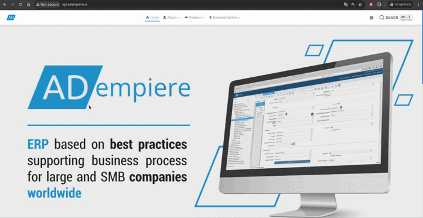

# Proyecto Universitario usando ADempiere :technologist:

<p align="center">
  <a href="https://github.com/jesusalbujas/CONTROL-PST/blob/main/LICENSE">
  <a href="https://github.com/jesusalbujas/">  </a>
  </a>
</p>


## Proyectos:


<div style="display: flex; flex-wrap: wrap; justify-content: space-around; align-items: center;">
  <div style="margin: 10px; text-align: center;">
    <b>Home Page</b><br>
    <a href="https://github.com/jesusalbujas/project-landing-page">
      
    </a>
  </div>
  <div style="margin: 10px; text-align: center;">
    <b>Asset Management System</b><br>
    <a href="https://github.com/jesusalbujas/assets-management-system">
      
    </a>
  </div>
  <div style="margin: 10px; text-align: center;">
    <b>Appwrite Management System</b><br>
    <a href="https://github.com/jesusalbujas/appwrite-management-system">
      
    </a>
  </div>
</div>

---

Este es un proyecto de implementación del sistema ADempiere para un Control de Activos Fijos.

> [!NOTE]
> Requerimientos:
> - Linux
> - Docker
> - Docker Compose
> - Git
> - Visual Studio Code (opcional).

## Descargar Docker y Git

En el directorio `install` de este repositorio se encuentra un script que realicé en shell que se encarga de instalar Docker, Git y si lo deseas configurar directamente tu usuario y correo electrónico de Github.

De esta manera, tan solo debes ejecutarlo:

- Usando bash

```bash
bash install_tools.sh
```

Usando shell

```shell\
./install_tools.sh
```

## Demo



## Configurando Entorno de Trabajo

¡Esta aplicación descarga las imágenes requeridas, ejecuta los contenedores configurados y restaura la base de datos en su máquina local simplemente levantando el Docker Compose!

Consiste en un proyecto de Docker Compose que define todos los servicios necesarios para ejecutar ADempiere, ZK, Vue y otros servicios.

Cuando se ejecuta, el proyecto Docker Compose finalmente ejecuta los servicios definidos en los archivos Docker Compose como contenedores Docker. Los contenedores Docker en ejecución constituyen la aplicación. El Docker Compose inicia diferentes servicios.

### Configurando dominio
Este servicio simplemente expone el puerto `80`. Debes configurarlo para usarlo como `api.adempiere.io` (para Linux simplemente agrega este dominio a `/etc/hosts`).

Ejemplo:

```shell
sudo nano /etc/hosts

127.0.0.1       localhost
127.0.1.1       adempiere
<Your-IP-Here>  api.adempiere.io
```

#### Levantar Docker Compose

```
cd docker-compose

docker compose up -d
```

#### Acceso a la base de datos

Conéctese a la base de datos a través del puerto `5436` con un gestor de base de datos, por ejemplo, pgAdmin.

### Beneficios de la aplicación:

- En su forma más simple, puede utilizarse como una demostración de la última versión de ADempiere, o de cualquier versión.
- No requiere una gran instalación para ponerlo en funcionamiento.
- Puede ejecutarse en diferentes hosts solo cambiando
  - la dirección IP por la del host
- Totalmente configurable: cualquier valor puede cambiarse para toda la aplicación en el archivo de configuración único **.env**.
- Las actualizaciones o reemplazos de contenedores o imágenes individuales pueden realizarse fácilmente, lo que agiliza los despliegues y pruebas.
- Ideal para situaciones de prueba debido a su facilidad de configuración y ejecución.
- No se requiere un profundo conocimiento de la instalación de ADempiere, la instalación del servidor de aplicaciones, Docker, imágenes o Postgres.
- Se pueden agregar nuevos servicios fácilmente.

### Desactivar SSL al Keycloak

```sh
/opt/keycloak/bin/kcadm.sh config credentials --server "http://server_name:3333" --realm master --user admin --password admin && /opt/keycloak/bin/kcadm.sh update realms/master -s sslRequired=NONE
```
