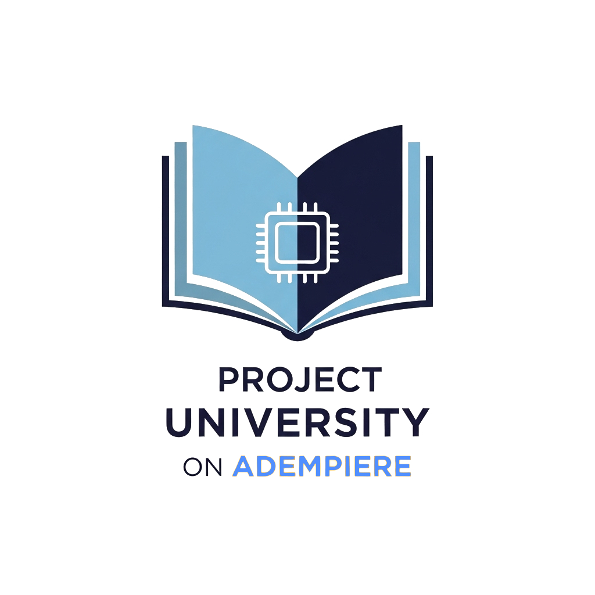
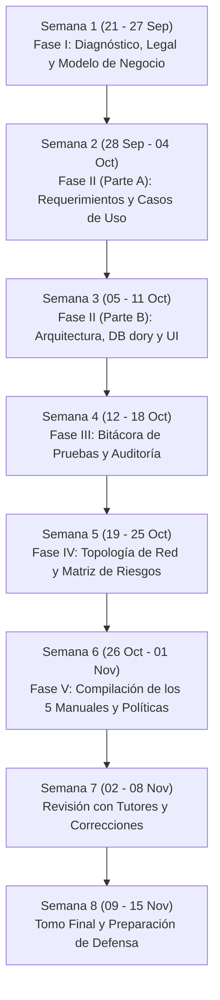
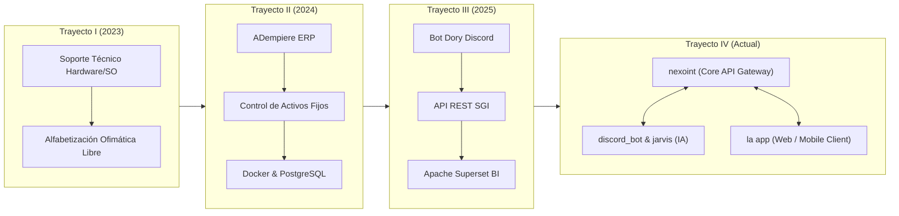
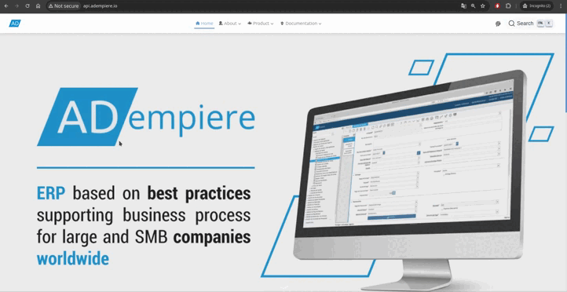

<p align="center">
  <a href="https://github.com/jesusalbujas/control-pst">
    
  </a>
</p>

<h1 align="center">Control PST & Ecosistema de Servicios Tecnológicos</h1>

<p align="center">
  <strong>Universidad Politécnica Territorial del Estado Portuguesa "Juan de Jesús Montilla" (UPTEP JJ Montilla)</strong><br>
  <em>Programa Nacional de Formación en Informática (PNFI) — Acarigua, Portuguesa, Venezuela</em>
</p>

<p align="center">
  
  
  
  
  
  
  
</p>

---

## 📖 Descripción General

**Control PST** es el repositorio central que consolida la infraestructura técnica, el despliegue de microservicios contenerizados y la memoria histórica de los **Proyectos Socio Tecnológicos (PST I, II, III y IV)** desarrollados a lo largo del Programa Nacional de Formación en Informática (PNFI).

El proyecto integra soluciones de gestión empresarial (ERP), automatización con bots de soporte interactivo, analítica de datos en tiempo real y la nueva arquitectura modular orientada a microservicios e inteligencia aplicada (`nexoint`, `discord_bot`/`jarvis` y `la app`).

---

## 📚 Centro de Documentación y Memoria de Proyectos (PST)

Toda la documentación técnica, esquemas normativos del PNFI y desgloses por trayecto se encuentran organizados y centralizados:

| Documento | Enlace | Descripción |
| :--- | :---: | :--- |
| 📑 **Índice General de Documentación** | [**Ver Índice**](./docs/README.md) | Portal maestro con línea de tiempo, enlaces y recursos. |
| 📋 **Esquemas PST 2018 (Markdown)** | [**Ver Esquema**](./docs/esquemas-pst-2018.md) | Transcripción íntegra del esquema oficial 2018 para Trayectos I al IV. |
| 📄 **Esquemas PST 2018 (PDF Original)** | [**Descargar PDF**](./docs/ESQUEMAS%20DE%20PST%202018.pdf) | Documento original emitido por la coordinación del PNFI. |
| 🏫 **Trayecto I (PST I)** | [**Ver Proyecto**](./docs/proyectos/pst-1.md) | Alfabetización y soporte técnico en Software Libre (U.E.C. Fe y Alegría). |
| 🏢 **Trayecto II (PST II)** | [**Ver Proyecto**](./docs/proyectos/pst-2.md) | Implementación de módulo de Activos Fijos en ADempiere ERP (ERP Consultores C.A.). |
| 🌐 **Trayecto III (PST III)** | [**Ver Proyecto**](./docs/proyectos/pst-3.md) | Sistema Web de Servicios, Bot Dory (Discord) y Superset BI (ERP Consultores C.A.). |
| 🚀 **Trayecto IV (PST IV - Actual)** | [**Ver Arquitectura**](./docs/proyectos/pst-4-arquitectura.md) | Nueva arquitectura: `nexoint` (API Core), `discord_bot` (`jarvis`) y `la app`. |
| 🗄️ **Modelo de Base de Datos Relacional** | [**Ver Modelo de BD**](./docs/database/README.md) | Esquema `dory` en Supabase (PostgreSQL 16), diagramas ER, RBAC y diccionario. |

---

## 📅 Plan de Ejecución y Cronograma Operativo del Informe PST IV

> [!IMPORTANT]
> **Fecha de Inicio Oficial:** **Lunes 21 de Septiembre de 2026**  
> **Meta:** Completar la redacción integral, validación técnica, compilación de manuales y entrega del tomo final del informe de **Proyecto Socio Tecnológico IV** cumpliendo al 100% con el [Esquema PNFI 2018](./docs/esquemas-pst-2018.md).


```mermaid
flowchart TD
    S1["Semana 1 (21 - 27 Sep)<br>Fase I: Diagnóstico, Legal y Modelo de Negocio"] --> S2["Semana 2 (28 Sep - 04 Oct)<br>Fase II (Parte A): Requerimientos y Casos de Uso"]
    S2 --> S3["Semana 3 (05 - 11 Oct)<br>Fase II (Parte B): Arquitectura, DB dory y UI"]
    S3 --> S4["Semana 4 (12 - 18 Oct)<br>Fase III: Bitácora de Pruebas y Auditoría"]
    S4 --> S5["Semana 5 (19 - 25 Oct)<br>Fase IV: Topología de Red y Matriz de Riesgos"]
    S5 --> S6["Semana 6 (26 Oct - 01 Nov)<br>Fase V: Compilación de los 5 Manuales y Políticas"]
    S6 --> S7["Semana 7 (02 - 08 Nov)<br>Revisión con Tutores y Correcciones"]
    S7 --> S8["Semana 8 (09 - 15 Nov)<br>Tomo Final y Preparación de Defensa"]
```

### 🗓️ Cronograma Detallado de Actividades por Semanas

| Semana / Fechas | Fase / Capítulo a Redactar | Tareas Específicas a Ejecutar por el Equipo | Entregable Semanal |
| :--- | :--- | :--- | :--- |
| **Semana 1**<br>*(21/09 al 27/09/2026)* | **Fase I:** Planificación, Diagnóstico y Modelo de Negocio | • Redactar reseña histórica y organigrama de ERP Consultores y Asociados C.A.<br>• Desarrollar fundamentación legal (CRBV Art. 110, Ley de Infogobierno, Plan de la Patria).<br>• Redactar narrativa de factibilidad (técnica, económica, social, operativa).<br>• Transcribir y redactar el Modelo de Negocio Canvas, FODA y Árbol de Problemas basado en [`pst-4-arquitectura.md`](./docs/proyectos/pst-4-arquitectura.md#2-fase-i-planificación-diagnóstico-y-modelo-de-negocio). | **Borrador Completo de Fase I** listo para revisión. |
| **Semana 2**<br>*(28/09 al 04/10/2026)* | **Fase II (Parte A):** Requerimientos del Software | • Llenar plantillas oficiales de Requerimientos Funcionales (RF) y No Funcionales (RNF).<br>• Elaborar diagramas de Casos de Uso del Software (CUS) maestros y transaccionales.<br>• Redactar planillas de especificación de casos de uso (apertura de tickets por Discord, imputación de horas, releases con Jarvis). | **Fichas de Requerimientos y Casos de Uso (CUS)** terminadas. |
| **Semana 3**<br>*(05/10 al 11/10/2026)* | **Fase II (Parte B):** Diseño y Desarrollo del Software | • Justificar la metodología de desarrollo (**MeRinde**) y estándar de calidad (**RECLAMO**).<br>• Documentar la arquitectura de microservicios y seguridad (OWASP/NIST, Google/Discord OAuth).<br>• Incorporar el modelo Entidad-Relación y diccionario del esquema `dory` desde [`docs/database/README.md`](./docs/database/README.md).<br>• Adjuntar capturas de pantallas y formularios de `nexoint` y maquetas de `la app`. | **Borrador Completo de Fase II** integrado con diagramas. |
| **Semana 4**<br>*(12/10 al 18/10/2026)* | **Fase III:** Implantación, Pruebas y Auditoría | • Ejecutar y registrar las bitácoras de casos de prueba (unitarias, integración y UAT).<br>• Documentar pruebas de carga y tiempos de respuesta de la API.<br>• Redactar el **Informe de Auditoría Informática** (técnicas SAST/DAST, control de accesos, planes de backup).<br>• Elaborar el análisis e interpretación de métricas de calidad de software. | **Borrador Completo de Fase III** con evidencias y reporte de auditoría. |
| **Semana 5**<br>*(19/10 al 25/10/2026)* | **Fase IV:** Resultados, Red y Evaluación de Riesgos | • Redactar la descripción general del producto y proceso de optimización operativa.<br>• Documentar y explicar los diagramas lógicos y físicos de la arquitectura de red (Docker / VPS / Supabase).<br>• Desarrollar el análisis descriptivo y planes de mitigación de la **Matriz de Riesgos** (técnico, financiero, social, legal). | **Borrador Completo de Fase IV** consolidado. |
| **Semana 6**<br>*(26/10 al 01/11/2026)* | **Fase V:** Manuales y Políticas de Seguridad | • Redactar el **Manual de Usuario** (ilustrado con capturas de Discord y la app web).<br>• Redactar el **Manual de Sistemas** (endpoints Swagger/OpenAPI y contratos de datos).<br>• Redactar el **Manual de Instalación** (guía paso a paso con Docker Compose y variables `.env`).<br>• Redactar el **Manual de Normas y Procedimientos**.<br>• Redactar las **Políticas y Estándares de Seguridad Informática** (físicas y lógicas). | **Los 5 Manuales Técnicos y de Usuario** finalizados. |
| **Semana 7**<br>*(02/11 al 08/11/2026)* | **Revisión General y Ajustes de Tutores** | • Unificar los capítulos en un solo tomo maestro siguiendo las normas de presentación de la UPTEP.<br>• Sesión de revisión con la Tutora Académica y el Tutor Comunitario.<br>• Aplicar correcciones de estilo, bibliografía (normas APA) y anexos. | **Tomo Preliminar Validado** por tutores. |
| **Semana 8**<br>*(09/11 al 15/11/2026)* | **Entrega Formal y Preparación de Defensa** | • Encuadernación y entrega formal del informe a la coordinación del PNFI.<br>• Elaboración de diapositivas y guion de presentación para la defensa pública de grado.<br>• Pruebas de demostración en vivo (*live demo*) del ecosistema funcionando. | **Entrega Definitiva y Socialización Exitosa del PST IV.** |

---

### 📌 Pautas de Seguimiento y Trabajo en Equipo

1. **Punto de Partida Obligatorio:** Todos los redactores deben consultar [`docs/proyectos/pst-4-arquitectura.md`](./docs/proyectos/pst-4-arquitectura.md) y [`docs/database/README.md`](./docs/database/README.md) antes de redactar cada sección técnica.
2. **Reuniones Semanales de Sincronización:** Cada viernes se revisará el porcentaje de avance de la fase correspondiente a la semana.
3. **Control de Versiones en Git:** Cada sección redactada se subirá a ramas de trabajo documentadas para evitar pérdidas de información.

---

## 🏛️ Evolución de la Arquitectura


```mermaid
flowchart LR
    subgraph T1["Trayecto I (2023)"]
        A1["Soporte Técnico Hardware/SO"] --> A2["Alfabetización Ofimática Libre"]
    end

    subgraph T2["Trayecto II (2024)"]
        B1["ADempiere ERP"] --> B2["Control de Activos Fijos"]
        B2 --> B3["Docker & PostgreSQL"]
    end

    subgraph T3["Trayecto III (2025)"]
        C1["Bot Dory Discord"] --> C2["API REST SGI"]
        C2 --> C3["Apache Superset BI"]
    end

    subgraph T4["Trayecto IV (Actual)"]
        D1["nexoint (Core API Gateway)"] <--> D2["discord_bot & jarvis (IA)"]
        D1 <--> D3["la app (Web / Mobile Client)"]
    end

    T1 --> T2 --> T3 --> T4
```

---

## 📂 Estructura del Repositorio

```
control-pst/
├── customization/               <- Personalizaciones, scripts Groovy, SQL y validaciones ADempiere
│   ├── process/                 <- Procesos de negocio (Asignación, Devolución, Ubicación)
│   ├── sql/                     <- Triggers y estructuras de tablas custom
│   ├── validations/             <- Reglas de validación en tiempo de ejecución
│   └── report/                  <- Reportes maestros y transaccionales
├── deployment/                  <- Recetas de despliegue contenerizado (Docker Compose)
│   ├── docker-compose.yml       <- Orquestación principal ADempiere ERP y PostgreSQL
│   ├── keycloak/                <- Proveedor de identidad y SSO para ADempiere
│   ├── dory-keycloak/           <- Configuración Keycloak y temas para Bot Dory
│   ├── dory_app/                <- Despliegue de aplicación web y proxy Nginx
│   ├── superset/                <- Plataforma de Business Intelligence (Apache Superset)
│   └── postgresql/              <- Scripts de inicialización y backups de base de datos
├── docs/                        <- Documentación técnica centralizada
│   ├── README.md                <- Índice maestro de documentación
│   ├── esquemas-pst-2018.md     <- Esquema oficial PNFI en formato Markdown
│   ├── ESQUEMAS DE PST 2018.pdf <- Documento PDF original
│   ├── diagrams/                <- Diagramas de arquitectura y workflows
│   └── proyectos/               <- Documentación detallada de PST I, II, III y IV
├── tools/                       <- Scripts de automatización y herramientas de utilidad
│   ├── install_tools.sh         <- Instalador automatizado de Docker, Compose y Git
│   ├── backup.sh                <- Script de respaldo de bases de datos
│   └── estructura.sql / .dbml   <- Modelado y esquema relacional de datos
└── README.md                    <- Presentación y guía principal del repositorio
```

---

## ⚡ Guía de Inicio Rápido (Quickstart)

### 1. Requisitos Previos
- Sistema Operativo: Linux (Ubuntu 22.04+ / Debian 12+ recomendado) o WSL2.
- Git y Docker Engine con plugin Docker Compose v2.

### 2. Instalación Automatizada de Dependencias

Si aún no cuenta con Docker o Git en su equipo, ejecute el script automatizado incluido en el directorio `tools/`:

```bash
chmod +x tools/install_tools.sh
./tools/install_tools.sh
```

### 3. Configuración de Host y Dominio Local

Agregue la resolución de dominios locales en su archivo `/etc/hosts`:

```bash
sudo nano /etc/hosts
```

Agregue las siguientes entradas:
```text
127.0.0.1       localhost
127.0.0.1       adempiere
127.0.0.1       api.adempiere.io
```

### 4. Despliegue del Entorno con Docker Compose

Acceda al directorio `deployment/` y levante los servicios:

```bash
cd deployment

# Levantar contenedores en segundo plano
docker compose up -d
```

### 5. Servicios Disponibles y Puertos

| Servicio | URL / Puerto | Descripción |
| :--- | :---: | :--- |
| **ADempiere Web ZK** | `http://localhost:8080` / `http://api.adempiere.io` | Interfaz Web de Gestión ERP |
| **Base de Datos PostgreSQL** | `localhost:5436` | Instancia de base de datos relacional (User: `adempiere`) |
| **Keycloak SSO Auth** | `http://localhost:3333` | Servidor de Identidad y Autenticación Centralizada |
| **Apache Superset BI** | `http://localhost:8088` | Tableros de analítica y métricas de soporte (`deployment/superset`) |

---

## 🔐 Configuración de Seguridad en Keycloak

Para entornos de desarrollo local donde no se utilice SSL/HTTPS, desactive el requerimiento de SSL en el Realm master ejecutando:

```bash
docker exec -it <nombre_contenedor_keycloak> /opt/keycloak/bin/kcadm.sh config credentials \
  --server "http://localhost:3333" \
  --realm master \
  --user admin \
  --password admin && \
docker exec -it <nombre_contenedor_keycloak> /opt/keycloak/bin/kcadm.sh update realms/master -s sslRequired=NONE
```

---

## 📊 Demostración de ADempiere ERP



---

## 👥 Equipo de Autores y Créditos

- **Jesús Albujas** ([@jesusalbujas](https://github.com/jesusalbujas))
- **Jesús Hernández**
- **Daniel Pérez**
- **José Zúñiga**
- **Giovana Garrido**
- **Albany Reyes**
- **Candy Gutiérrez**
- **Cristian Camacho**

**Institución:** Universidad Politécnica Territorial del Estado Portuguesa "Juan de Jesús Montilla" (UPTEP JJ Montilla)  
**Comunidades Beneficiadas:** U.E.C. Fe y Alegría "Nuestra Señora de Coromoto" & ERP Consultores y Asociados C.A.
