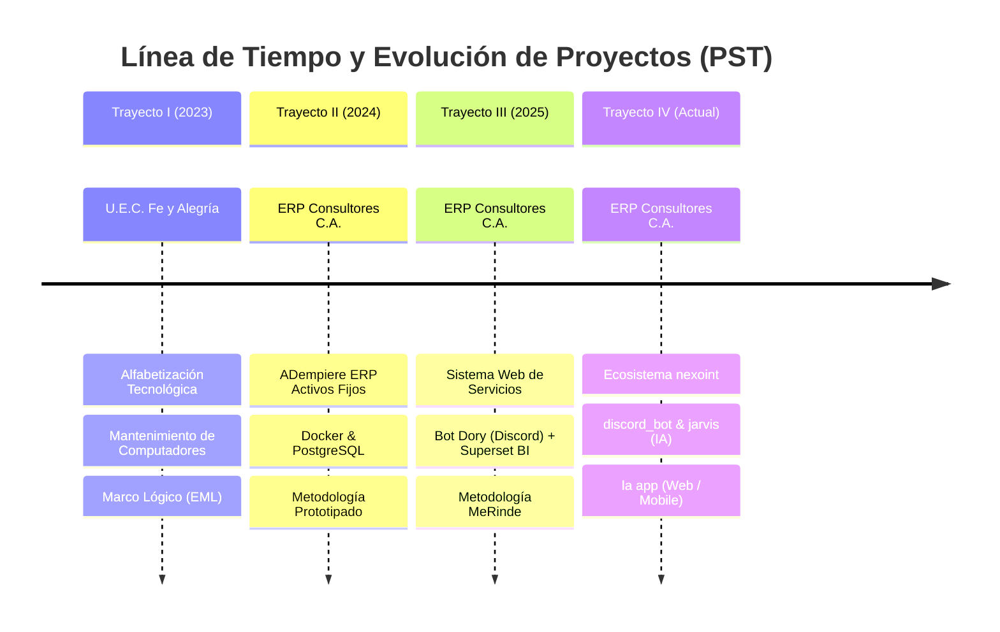

# Índice General de Documentación - Control PST

Bienvenido al centro de documentación del repositorio **Control PST** de la Universidad Politécnica Territorial del Estado Portuguesa "Juan de Jesús Montilla" (UPTEP JJ Montilla), Programa Nacional de Formación en Informática (PNFI).

---

## 📑 1. Esquema Oficial de Proyecto Socio Tecnológico (PST)

Consulte la normativa y estructura metodológica oficial aprobada por la coordinación del PNFI:

| Documento | Formato | Descripción |
| :--- | :---: | :--- |
| [**Esquemas de PST 2018 (Markdown)**](./esquemas-pst-2018.md) | `.md` | Transcripción íntegra y estructurada del esquema oficial 2018 para los Trayectos I, II, III y IV. |
| [**Esquemas de PST 2018 (PDF Original)**](./ESQUEMAS%20DE%20PST%202018.pdf) | `.pdf` | Documento fuente original emitido por la coordinación del PNFI. |

---

## 🚀 2. Trayectoria de Proyectos Socio Tecnológicos (Trayectos I al IV)

A continuación se presenta la evolución cronológica y técnica de los proyectos desarrollados a lo largo de la carrera de Ingeniería en Informática:



---

## 📂 3. Directorio de Documentación de Proyectos

Haga clic en cada proyecto para acceder al análisis detallado, diagnóstico, requerimientos, arquitectura y resultados:

docs/
├── esquemas-pst-2018.md          <- Esquema normativo oficial del PNFI
├── ESQUEMAS DE PST 2018.pdf      <- PDF original conservado
├── README.md                     <- Este índice general
├── database/
│   └── README.md                 <- Modelo de Base de Datos Relacional NexoInt (Esquema dory)
└── proyectos/
    ├── pst-1.md                  <- Trayecto I: Alfabetización y Soporte en Fe y Alegría
    ├── pst-2.md                  <- Trayecto II: ADempiere ERP Activos Fijos
    ├── pst-3.md                  <- Trayecto III: Sistema Web, Bot Dory y Superset BI
    └── pst-4-arquitectura.md     <- Trayecto IV: nexoint, discord_bot (jarvis) y la app
```

### 🗄️ Modelo de Base de Datos y Persistencia:
- [**Modelo de Base de Datos Relacional NexoInt (Esquema `dory`)**](./database/README.md): Diagramas ER detallados por dominio (Seguridad/RBAC, Tickets/Hilos, Facturación/Bolsas de Horas, Releases/Jarvis AI y Reportes), Diccionario de Datos exhaustivo con más de 25 entidades, funciones RPC y políticas RLS.

### Resumen por Proyecto:

1. [**Proyecto Socio Tecnológico I (Trayecto I)**](./proyectos/pst-1.md)
   - **Comunidad:** U.E.C. Fe y Alegría "Nuestra Señora de Coromoto".
   - **Alcance:** Soporte técnico preventivo/correctivo y talleres de alfabetización en software libre y ofimática (LibreOffice) a estudiantes de 5to/6to grado y docentes.
   - **Metodología:** Enfoque del Marco Lógico (EML).

2. [**Proyecto Socio Tecnológico II (Trayecto II)**](./proyectos/pst-2.md)
   - **Organización:** ERP Consultores y Asociados C.A.
   - **Alcance:** Implementación y parametrización de un módulo de gestión de Activos Fijos sobre **ADempiere ERP**, contenerizado con Docker y base de datos PostgreSQL.
   - **Metodología:** Modelo de Construcción de Prototipos y calidad RECLAMO.

3. [**Proyecto Socio Tecnológico III (Trayecto III)**](./proyectos/pst-3.md)
   - **Organización:** ERP Consultores y Asociados C.A.
   - **Alcance:** Sistema de Gestión Web para Servicios de Software (SGI) con integración del **Bot Dory en Discord**, API REST backend y dashboards analíticos de horas consumidas en **Apache Superset**.
   - **Metodología:** Metodología MeRinde y calidad RECLAMO.

4. [**Proyecto Socio Tecnológico IV (Trayecto IV - Proyecto Actual)**](./proyectos/pst-4-arquitectura.md)
   - **Organización:** ERP Consultores y Asociados C.A.
   - **Alcance:** Nueva Arquitectura Modular y Distribuida desglosada en:
     - **`nexoint`**: API Gateway, Core Backend, gestión de contratos, tarifas, tickets y reglas de negocio.
     - **`discord_bot` (y `jarvis`)**: Agentes conversacionales y asistente de automatización cognitiva e integración en tiempo real.
     - **`la app` (en desarrollo)**: Aplicación frontend web y móvil para autoservicio de clientes y control operativo.
   - **Alineación:** Fase I (Modelo de Negocio, Procesos, Casos de Uso del Negocio), Fase II (Microservicios, Diagramas C4/UML/ER), Fase III (Pruebas y Auditoría), Fase IV (Topología de Red y Riesgos) y Fase V (Manuales y Políticas de Seguridad).

---

## 🛠️ 4. Recursos y Diagramas Adicionales del Repositorio

- [Diagrama de Arquitectura ERP Docker](./diagrams/docker-structure-adempiere-university-project.png)
- [Diagrama de Flujo de Trabajo](./diagrams/workflow.png)
- [Demostración ADempiere ERP](./ADempiere_demo.gif)
