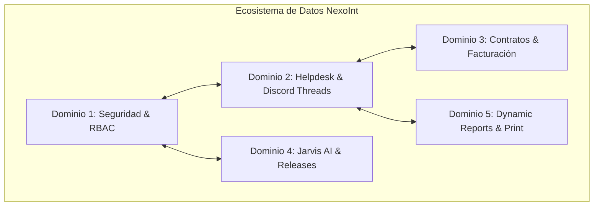
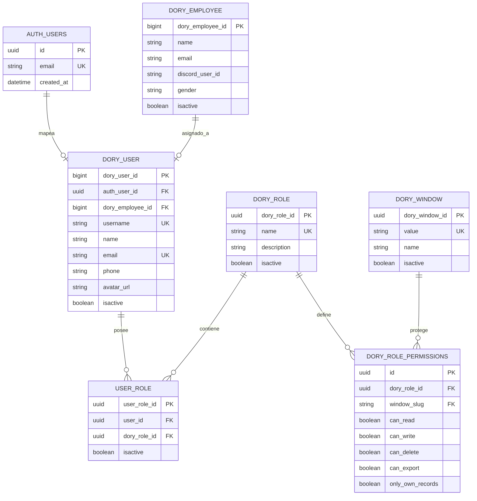
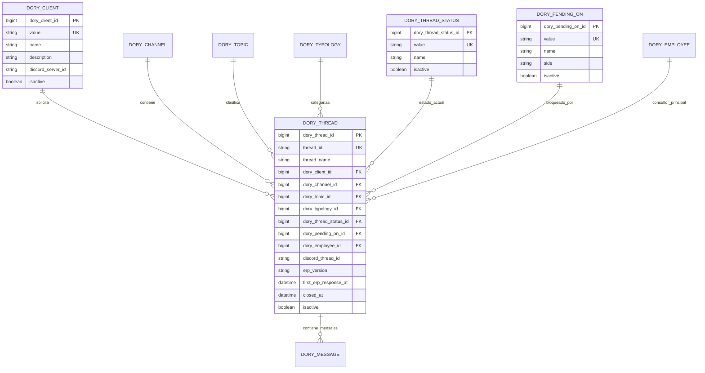
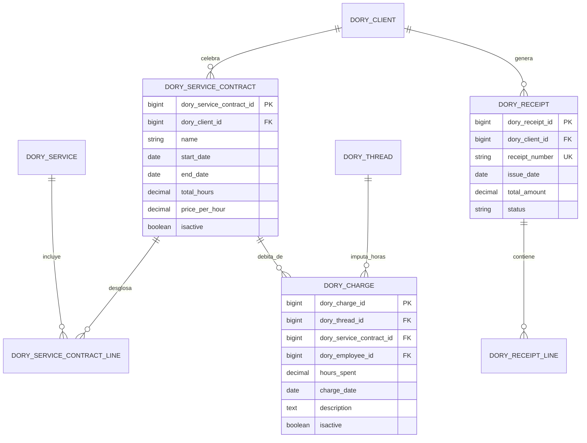
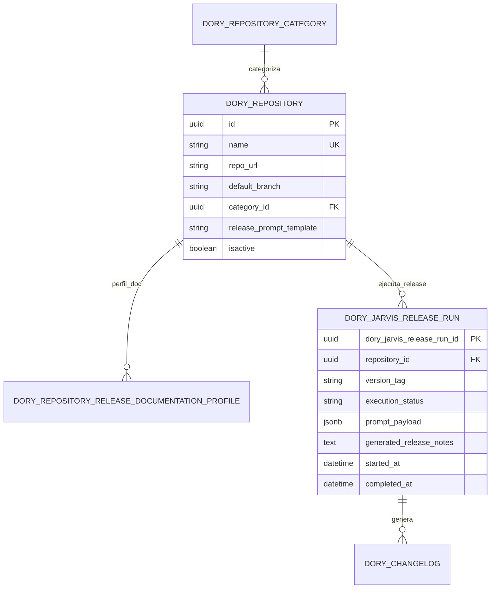
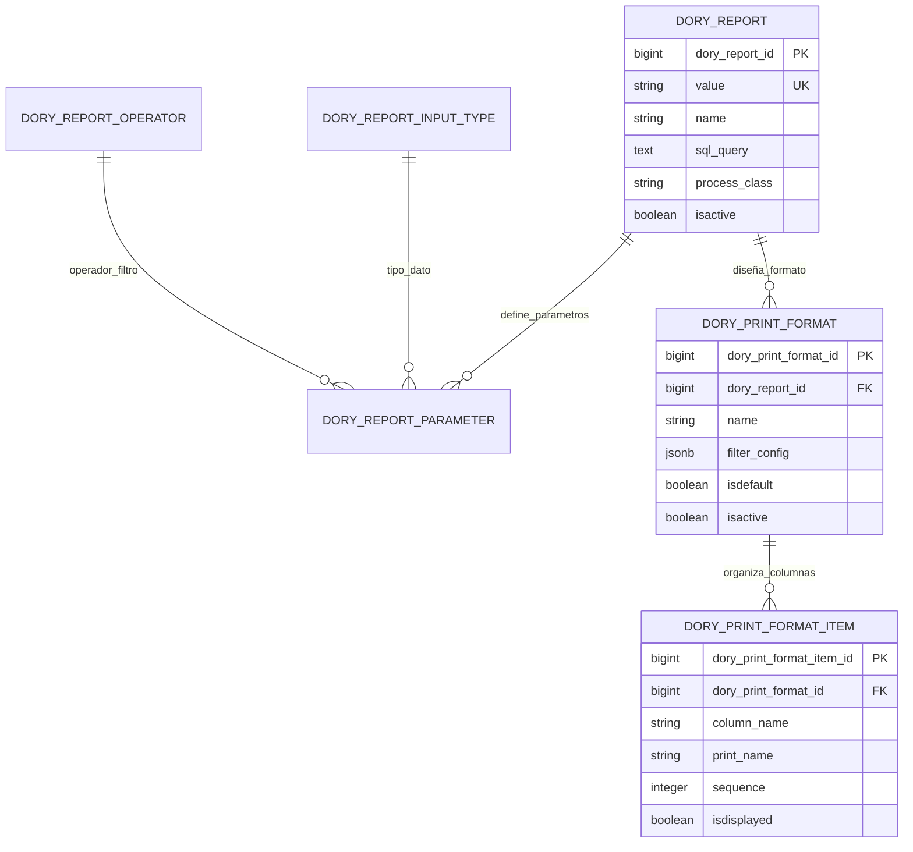

# Modelo de Base de Datos Relacional - Ecosistema NexoInt (Esquema `dory`)

> **Motor de Base de Datos:** PostgreSQL 16 (Alojado en Supabase BaaS)  
> **Esquema Principal:** `dory`  
> **Integración:** NexoInt Core Backend, Jarvis AI Engine & Discord Bot  
> **Convención y Estándar:** Compatible con iDempiere / ADempiere (`isactive`, nomenclatura snake_case, auditoría granular)  
> **Enlace al Proyecto:** [PST IV Arquitectura](../proyectos/pst-4-arquitectura.md)

---

## Tabla de Contenidos

- [Modelo de Base de Datos Relacional - Ecosistema NexoInt (Esquema `dory`)](#modelo-de-base-de-datos-relacional---ecosistema-nexoint-esquema-dory)
  - [Tabla de Contenidos](#tabla-de-contenidos)
  - [1. Visión General y Dominios del Modelo](#1-visión-general-y-dominios-del-modelo)
  - [2. Diagramas Entidad-Relación por Dominios](#2-diagramas-entidad-relación-por-dominios)
    - [2.1 Dominio 1: Seguridad, Identidad y Control de Acceso (RBAC)](#21-dominio-1-seguridad-identidad-y-control-de-acceso-rbac)
    - [2.2 Dominio 2: Mesa de Ayuda, Hilos y Gestión de Tickets](#22-dominio-2-mesa-de-ayuda-hilos-y-gestión-de-tickets)
    - [2.3 Dominio 3: Contratos de Servicio, Bolsas de Horas y Facturación](#23-dominio-3-contratos-de-servicio-bolsas-de-horas-y-facturación)
    - [2.4 Dominio 4: Release Management, Repositorios e Integración con Jarvis AI](#24-dominio-4-release-management-repositorios-e-integración-con-jarvis-ai)
    - [2.5 Dominio 5: Motor de Reportes Dinámicos y Formatos de Impresión](#25-dominio-5-motor-de-reportes-dinámicos-y-formatos-de-impresión)
  - [3. Diccionario de Datos Completo (Tablas y Atributos)](#3-diccionario-de-datos-completo-tablas-y-atributos)
    - [3.1 Tablas de Seguridad y Usuarios](#31-tablas-de-seguridad-y-usuarios)
    - [3.2 Tablas de Organización y Clientes](#32-tablas-de-organización-y-clientes)
    - [3.3 Tablas de Tickets y Operaciones de Soporte](#33-tablas-de-tickets-y-operaciones-de-soporte)
    - [3.4 Tablas Comerciales y de Facturación](#34-tablas-comerciales-y-de-facturación)
    - [3.5 Tablas de Release Management y Jarvis AI](#35-tablas-de-release-management-y-jarvis-ai)
    - [3.6 Tablas de Reportes y Print Formats](#36-tablas-de-reportes-y-print-formats)
  - [4. Funciones RPC y Procedimientos Almacenados Clave](#4-funciones-rpc-y-procedimientos-almacenados-clave)
  - [5. Políticas de Seguridad RLS y Aislamiento de Esquema](#5-políticas-de-seguridad-rls-y-aislamiento-de-esquema)

---

## 1. Visión General y Dominios del Modelo

El modelo de datos de **NexoInt** está encapsulado dentro del esquema PostgreSQL `dory` en Supabase. Cuenta con **61 migraciones estructuradas** y agrupa más de 25 entidades relacionales diseñadas para alta concurrencia, auditoría exhaustiva y soporte de operaciones en tiempo real.



---

## 2. Diagramas Entidad-Relación por Dominios

### 2.1 Dominio 1: Seguridad, Identidad y Control de Acceso (RBAC)



---

### 2.2 Dominio 2: Mesa de Ayuda, Hilos y Gestión de Tickets



---

### 2.3 Dominio 3: Contratos de Servicio, Bolsas de Horas y Facturación



---

### 2.4 Dominio 4: Release Management, Repositorios e Integración con Jarvis AI



---

### 2.5 Dominio 5: Motor de Reportes Dinámicos y Formatos de Impresión



---

## 3. Diccionario de Datos Completo (Tablas y Atributos)

### 3.1 Tablas de Seguridad y Usuarios

#### `dory.dory_user`
| Columna | Tipo | Nulo | Descripción / Restricción |
| :--- | :--- | :---: | :--- |
| `dory_user_id` | `bigint` | NO | Clave Primaria (Autoincremental) |
| `auth_user_id` | `uuid` | SÍ | FK a `auth.users.id` de Supabase Auth |
| `dory_employee_id`| `bigint` | SÍ | FK a `dory.dory_employee` |
| `username` | `text` | NO | Nombre de usuario único |
| `name` | `text` | NO | Nombre completo del usuario |
| `email` | `text` | NO | Correo electrónico de contacto |
| `phone` | `text` | SÍ | Teléfono de contacto |
| `avatar_url` | `text` | SÍ | URL del avatar en storage |
| `isactive` | `boolean`| NO | Estado lógico del registro (Default: `true`) |
| `last_login_at`| `timestamp`| SÍ | Último inicio de sesión |

#### `dory.dory_role`
| Columna | Tipo | Nulo | Descripción |
| :--- | :--- | :---: | :--- |
| `dory_role_id` | `uuid` | NO | Clave Primaria |
| `name` | `text` | NO | Nombre del rol (Admin, Consultor, Cliente, Auditor) |
| `description` | `text` | SÍ | Descripción del alcance del rol |
| `isactive` | `boolean`| NO | Estado activo/inactivo |

#### `dory.dory_role_permissions`
| Columna | Tipo | Nulo | Descripción |
| :--- | :--- | :---: | :--- |
| `id` | `uuid` | NO | Clave Primaria |
| `dory_role_id` | `uuid` | NO | FK a `dory_role.dory_role_id` |
| `window_slug` | `text` | NO | Identificador único de ventana/módulo |
| `can_read` | `boolean`| NO | Permiso de lectura |
| `can_write` | `boolean`| NO | Permiso de creación y edición |
| `can_delete` | `boolean`| NO | Permiso de borrado |
| `can_export` | `boolean`| NO | Permiso de exportación a Excel/PDF |
| `only_own_records`| `boolean`| NO | Restringe acceso únicamente a registros propios |

---

### 3.2 Tablas de Organización y Clientes

#### `dory.dory_client`
| Columna | Tipo | Nulo | Descripción |
| :--- | :--- | :---: | :--- |
| `dory_client_id` | `bigint` | NO | Clave Primaria |
| `value` | `text` | NO | Código o identificador fiscal (RIF) |
| `name` | `text` | NO | Razón social de la empresa cliente |
| `description` | `text` | SÍ | Información de contacto y notas |
| `discord_server_id`| `text`| SÍ | ID del servidor de Discord asignado |
| `isactive` | `boolean`| NO | Estado de cliente activo/inactivo |

#### `dory.dory_employee`
| Columna | Tipo | Nulo | Descripción |
| :--- | :--- | :---: | :--- |
| `dory_employee_id` | `bigint` | NO | Clave Primaria |
| `name` | `text` | NO | Nombre del consultor / empleado |
| `email` | `text` | NO | Correo corporativo |
| `discord_user_id` | `text` | SÍ | ID de Discord para menciones y asignaciones |
| `gender` | `text` | SÍ | Género |
| `isactive` | `boolean` | NO | Estado operativo |

---

### 3.3 Tablas de Tickets y Operaciones de Soporte

#### `dory.dory_thread`
| Columna | Tipo | Nulo | Descripción |
| :--- | :--- | :---: | :--- |
| `dory_thread_id` | `bigint` | NO | Clave Primaria autoincremental |
| `thread_id` | `text` | NO | Código alfanumérico del ticket (ej: `TKT-2026-001`) |
| `thread_name` | `text` | NO | Asunto / Título de la incidencia |
| `dory_client_id` | `bigint` | NO | FK a `dory_client` |
| `dory_channel_id` | `bigint` | SÍ | FK a `dory_channel` |
| `dory_topic_id` | `bigint` | SÍ | FK a `dory_topic` |
| `dory_typology_id` | `bigint` | SÍ | FK a `dory_typology` |
| `dory_thread_status_id`| `bigint`| NO | FK a `dory_thread_status` |
| `dory_pending_on_id`| `bigint`| SÍ | FK a `dory_pending_on` (Lado del bloqueo) |
| `dory_employee_id` | `bigint` | SÍ | Consultor principal asignado |
| `discord_thread_id` | `text` | SÍ | ID del hilo en Discord |
| `erp_version` | `text` | SÍ | Versión de ERP afectada (ZK / Swing / Core) |
| `first_erp_response_at`| `timestamp`| SÍ | Fecha/hora de primera respuesta técnica |
| `closed_at` | `timestamp`| SÍ | Fecha/hora de resolución y cierre |
| `isactive` | `boolean` | NO | Estado del registro (Default: `true`) |

---

## 4. Funciones RPC y Procedimientos Almacenados Clave

Para operaciones críticas que requieren validaciones de seguridad atómicas sin exponer permisos globales de `UPDATE`, NexoInt utiliza Procedimientos Almacenados `SECURITY DEFINER`:

```sql
-- Actualización segura del estado de bloqueo sin exponer toda la tabla dory_thread
CREATE OR REPLACE FUNCTION dory.update_thread_pending_on(
  p_thread_id bigint,
  p_pending_on text
)
RETURNS void
LANGUAGE plpgsql
SECURITY DEFINER
SET search_path = dory, public
AS $$
BEGIN
  IF auth.uid() IS NULL THEN
    RAISE EXCEPTION 'Se requiere autenticación para actualizar el ticket.';
  END IF;

  UPDATE dory.dory_thread
     SET dory_pending_on_id = (
       SELECT dory_pending_on_id 
       FROM dory.dory_pending_on 
       WHERE value = p_pending_on AND isactive = true 
       LIMIT 1
     )
   WHERE dory_thread_id = p_thread_id;
END;
$$;
```

---

## 5. Políticas de Seguridad RLS y Aislamiento de Esquema

1. **Aislamiento de Esquema:** Todo el modelo reside en el esquema privado `dory`, fuera del esquema `public`.
2. **Row Level Security (RLS):** Las políticas evalúan `auth.uid()` contra la tabla `dory.user_role` y `dory.dory_role_permissions`.
3. **Restricción de Registros Propios (`only_own_records`):** Si un rol tiene activo este flag, la vista de tickets solo devuelve registros donde `dory_employee_id` o `dory_client_id` coinciden con el usuario autenticado.
