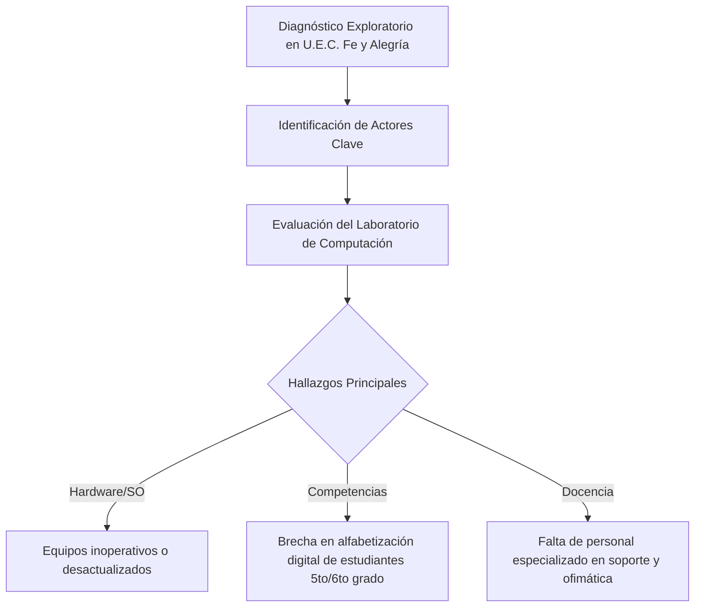
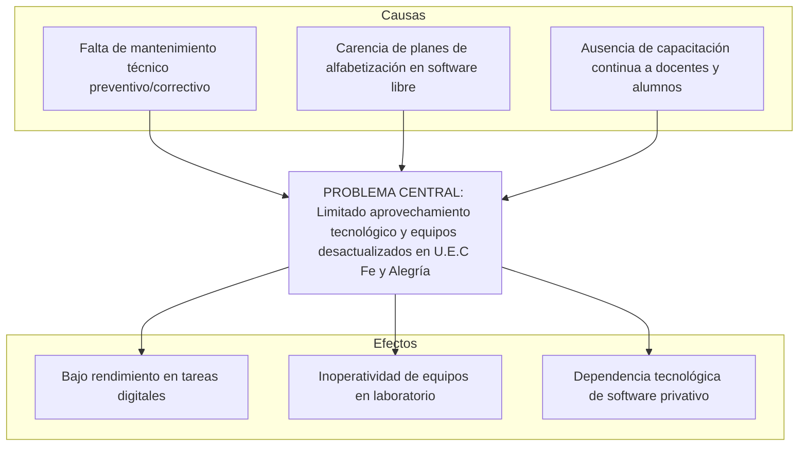
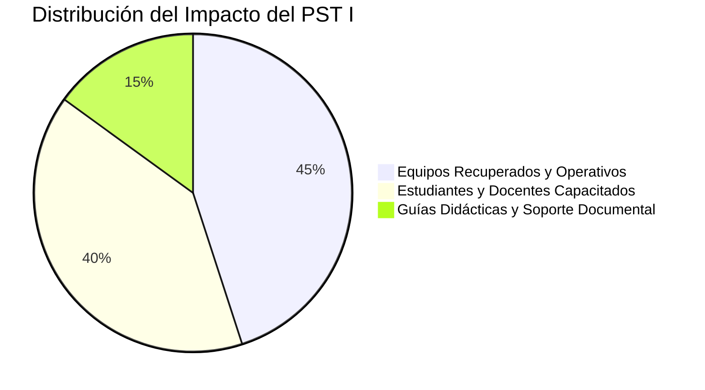

# Proyecto Socio Tecnológico I (Trayecto I)

> **Documento Base:** `PROYECTO SOCIO TECNOLÓGICO I.docx`  
> **Institución:** Universidad Politécnica Territorial del Estado Portuguesa "Juan de Jesús Montilla" (UPTEP JJ Montilla)  
> **Programa:** Programa Nacional de Formación en Informática (PNFI)  
> **Fecha de Culminación:** Noviembre 2023 | Acarigua, Estado Portuguesa  
> **Tutor Académico:** Profa. Eglee Rivas  

---

## 1. Ficha Técnica del Proyecto

| Parámetro | Detalle |
| :--- | :--- |
| **Título del Proyecto** | **Alfabetización y Soporte Técnico en Software Libre y Ofimática en la U.E.C Fe y Alegría “Nuestra Señora de Coromoto”** |
| **Línea de Investigación** | Soporte Técnico a Usuarios y Equipos / Formación Tecnológica Comunitaria |
| **Comunidad Beneficiada** | U.E.C. Fe y Alegría "Nuestra Señora de Coromoto" (Sector Bella Vista II, Acarigua) |
| **Equipo de Desarrollo** | • Jesús Albujas (C.I: 32.218.524) • Jesús Hernández (C.I: 31.009.224) • Daniel Pérez (C.I: 31.114.076) • José Zúñiga (C.I: 31.861.171) • Giovana Garrido (C.I: 31.009.108) • Cristian Camacho (C.I: 31.008.588) |
| **Metodología Aplicada** | Enfoque del Marco Lógico (EML) |

---

## 2. Contexto y Diagnóstico Comunitario

### 2.1 Reseña de la Comunidad
La **U.E.C. Fe y Alegría "Nuestra Señora de Coromoto"** se encuentra ubicada en la comunidad de *Bella Vista II* (sector noroeste de Acarigua, Portuguesa), fundada en la década de 1960. La institución educativa fue instaurada por la congregación de los Padres Jesuitas en 1962 con el propósito de brindar educación de calidad e inclusión a sectores vulnerables de la población.

### 2.2 Matriz FODA

| Tipo | Factores Internos / Externos |
| :--- | :--- |
| **Fortalezas (F)** | • Laboratorio de informática con infraestructura física disponible. • Apoyo de la directiva y docentes para la integración comunitaria. • Disposición de los estudiantes hacia nuevas actividades formativas. |
| **Oportunidades (O)** | • Red de colegios Fe y Alegría con lineamientos de inclusión social. • Programas de soberanía tecnológica e impulso del Software Libre. • Subvenciones institucionales para mantenimiento básico. |
| **Debilidades (D)** | • Falta de docente especializado fijo en el área de informática. • Desinterés inicial y brecha en el manejo de herramientas ofimáticas. • Equipos de computación sin mantenimiento preventivo periódico. |
| **Amenazas (A)** | • Fluctuaciones y fallas frecuentes en el suministro del fluido eléctrico. • Deserción estudiantil y limitaciones socioeconómicas del entorno. • Obsolescencia acelerada del hardware disponible. |

---

## 3. Formulación y Estructura del Problema

---

## 4. Ejecución del Plan de Acción y Productos Entregados

El proyecto estructuró su ejecución en dos vertientes principales:

### 4.1 Soporte Técnico Integral a Equipos
- **Diagnóstico y Limpieza:** Inspección física, remoción de polvo, verificación de fuentes de poder, placas madre, módulos RAM y almacenamiento.
- **Mantenimiento Correctivo:** Sustitución de componentes defectuosos y adecuación térmica.
- **Instalación y Configuración:** Despliegue de distribuciones de **GNU/Linux** orientadas a la educación, configurando controladores y entornos de escritorio ligeros.
- **Elaboración de Guía Didáctica:** Guía técnica de mantenimiento y arquitectura del computador para el personal del plantel.

### 4.2 Programa de Alfabetización Tecnológica
- **Población Objetivo:** Estudiantes de 5to y 6to grado de educación básica, además de personal docente.
- **Módulos Impartidos:**
  1. Fundamentos de hardware, software libre vs. privativo.
  2. Manejo del sistema operativo libre y gestión de archivos.
  3. Paquete Ofimático LibreOffice (Writer para procesamiento de texto, Calc para hojas de cálculo, Impress para presentaciones).
  4. Uso seguro y responsable de internet e investigación académica.
- **Material de Apoyo:** Plan diario de clase y manuales ilustrados con dinámicas participativas ("Aprender Haciendo").

---

## 5. Resultados y Valoración

- **Reactivación del Laboratorio:** Puesta a punto de las estaciones de trabajo del aula de informática, dejándolas 100% operativas.
- **Empoderamiento Comunitario:** Más de 60 estudiantes y docentes capacitados en el uso cotidiano de suites ofimáticas libres.
- **Sostenibilidad:** Entrega de guías de procedimientos para que la institución mantenga buenas prácticas en el cuidado del equipamiento informático.
