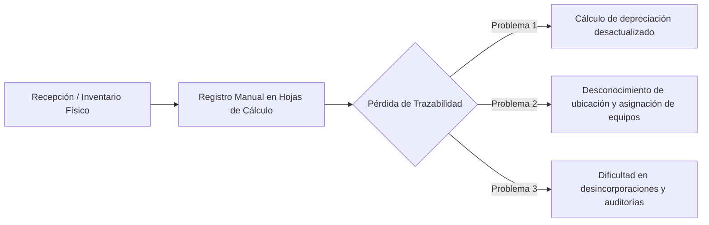
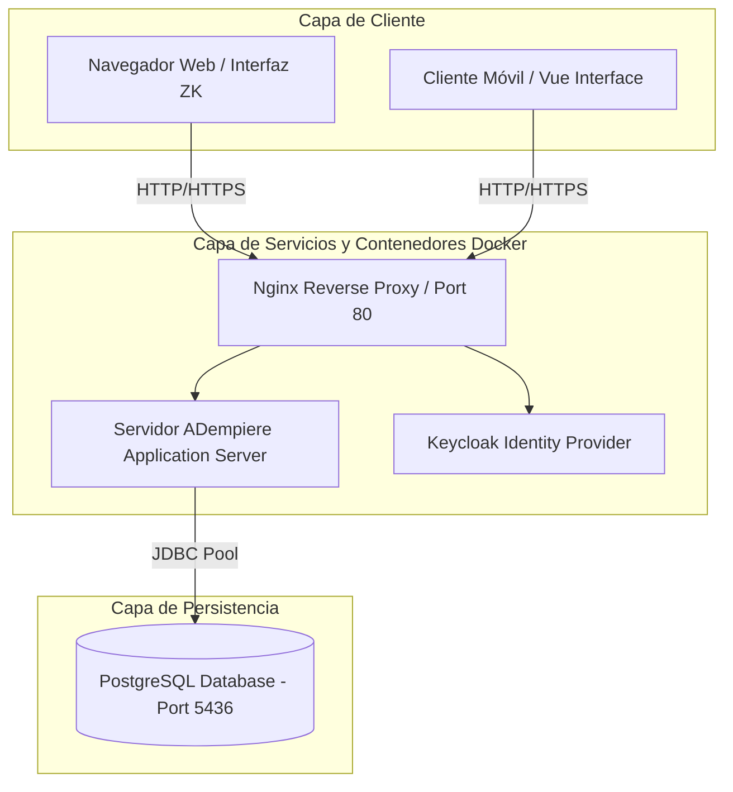
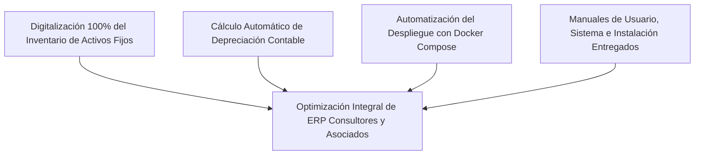

# Proyecto Socio Tecnológico II (Trayecto II)

> **Documento Base:** `Proyecto Sociotecnológico II.docx`  
> **Institución:** Universidad Politécnica Territorial del Estado Portuguesa "Juan de Jesús Montilla" (UPTEP JJ Montilla)  
> **Programa:** Programa Nacional de Formación en Informática (PNFI)  
> **Fecha de Culminación:** Mayo 2024 | Acarigua-Araure, Estado Portuguesa  
> **Docente Guía:** Prof. Dennis Chávez  

---

## 1. Ficha Técnica del Proyecto

| Parámetro | Detalle |
| :--- | :--- |
| **Título del Proyecto** | **Implementación de Software ERP para la Gestión Eficiente de Activos Fijos en ERP Consultores y Asociados C.A en Acarigua-Araure** |
| **Línea de Investigación** | Desarrollo y Parametrización de Sistemas Empresariales / Gestión de Software Libre |
| **Comunidad Beneficiada** | Empresa **ERP Consultores y Asociados C.A.** (Acarigua - Araure, Edo. Portuguesa) |
| **Equipo de Desarrollo** | • Giovana Garrido (C.I: 31.009.108) • Jesús Hernández (C.I: 31.009.224) • Daniel Pérez (C.I: 31.114.076) • José Zúñiga (C.I: 31.861.171) • Jesús Albujas (C.I: 32.218.524) |
| **Metodología de Desarrollo** | Modelo de Construcción de Prototipos |
| **Metodología de Calidad** | Estándar RECLAMO |

---

## 2. Contexto de la Organización y Diagnóstico

### 2.1 Sobre ERP Consultores y Asociados C.A.
Fundada en el año 2012 por iniciativa del Ing. Yamel Senih junto a un equipo de desarrolladores especializados en soluciones de software de gestión empresarial de código abierto.
- **Misión:** Ofrecer soluciones informáticas de alta calidad a través de plataformas ERP que impulsen la productividad empresarial.
- **Visión:** Posicionarse como referente tecnológico líder a nivel nacional e internacional en servicios de integración de software libre y optimización de procesos.

### 2.2 Problema Central
La empresa administraba el inventario y los activos fijos (equipos informáticos de oficina, servidores, mobiliario y licencias) mediante mecanismos tradicionales y hojas de cálculo no sincronizadas. Esto provocaba inconsistencia de datos, retrasos en la generación de reportes contables de depreciación y riesgos de extravío de activos en rotación técnica.

---

## 3. Arquitectura y Solución Tecnológica

Se diseñó e implementó una solución integral basada en el ecosistema **ADempiere ERP**, encapsulada en contenedores **Docker** para garantizar portabilidad, escalabilidad y facilidad de despliegue.

### 3.1 Pila Tecnológica Implementada
- **Core ERP:** ADempiere Business Suite (Java Open Source ERP/CRM).
- **Base de Datos:** PostgreSQL con esquemas relacionales optimizados para transacciones contables.
- **Virtualización y Despliegue:** Docker, Docker Compose, scripts automatizados en Bash (`install_tools.sh`).
- **Seguridad e Identidad:** Integración con Keycloak para SSO (Single Sign-On).

### 3.2 Módulos y Funcionalidades Clave de Activos Fijos
1. **Definición de Grupos y Categorías de Activos:** Clasificación estandarizada por tipo de bien y vida útil.
2. **Registro y Ficha de Activo (Maestro de Activos):** Seriales, especificaciones técnicas, fecha de adquisición, responsable asignado y valor contable inicial.
3. **Mecanismo Automatizado de Depreciación:** Configuración de métodos de depreciación según normativas contables vigentes.
4. **Historial de Asignaciones y Traslados:** Auditoría completa de transferencias entre empleados y sucursales.
5. **Proceso de Desincorporación y Mantenimiento:** Registro de bajas, obsolescencia o disposición final del activo.

---

## 4. Metodología y Modelo de Calidad

- **Metodología de Prototipado:** Construcción iterativa de ventanas y vistas en el diccionario de aplicaciones de ADempiere, validando cada formulario directamente con el personal administrativo.
- **Evaluación RECLAMO:** Evaluación de la calidad del software en dimensiones de:
  - *Requerimientos Cumplidos:* Trazabilidad total de altas, bajas y transferencias.
  - *Eficiencia:* Reducción superior al 80% en el tiempo de emisión de informes de activos fijos.
  - *Usabilidad:* Interfaces amigables con validaciones automáticas.

---

## 5. Resultados e Impacto Logrado

- **Control Centralizado:** Migración completa de registros dispersos hacia una base de datos única y confiable.
- **Portabilidad:** Generación de un repositorio con recetas Docker listas para levantar el entorno de desarrollo y producción en minutos.
- **Documentación Completa:** Elaboración de manuales técnicos y de usuario entregados formalmente a la empresa.
