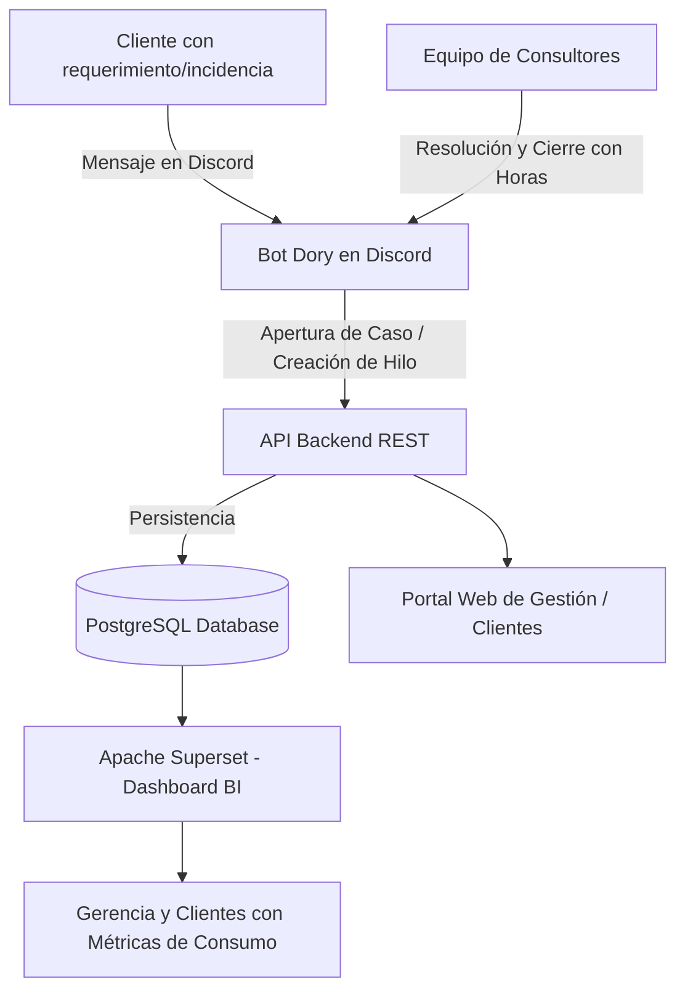
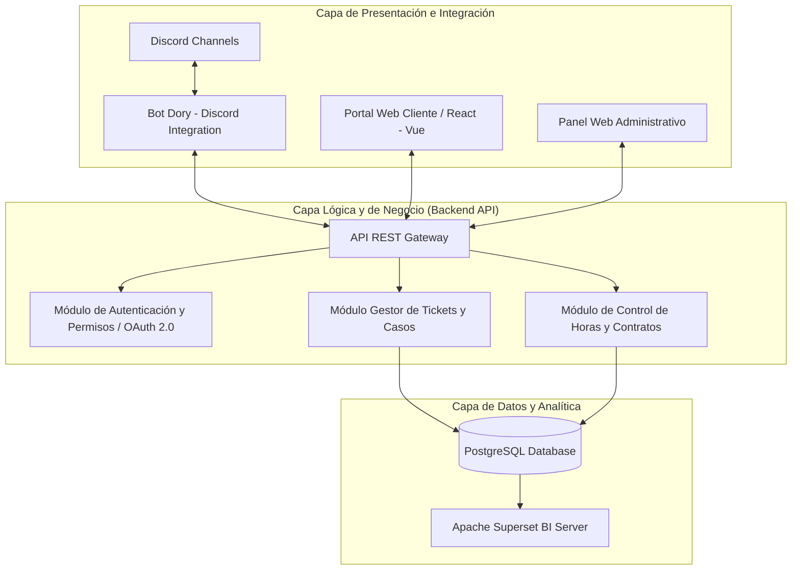
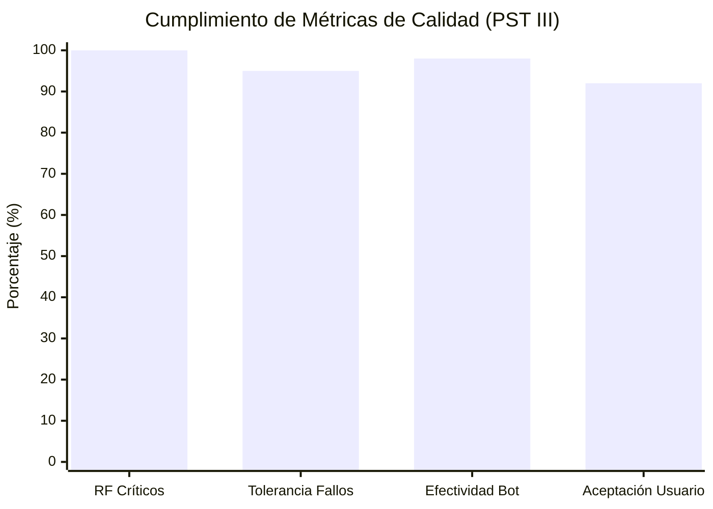

# Proyecto Socio Tecnológico III (Trayecto III)

> **Documento Base:** `Proyecto Socio-tecnológico III.docx`  
> **Código PST:** `PNFI-ACA32-636-1/3`  
> **Institución:** Universidad Politécnica Territorial del Estado Portuguesa "Juan de Jesús Montilla" (UPTEP JJ Montilla)  
> **Programa:** Programa Nacional de Formación en Informática (PNFI)  
> **Fecha de Culminación:** Diciembre 2025 | Acarigua, Estado Portuguesa  
> **Docente de Proyecto:** Profa. Elizabeth Panza  
> **Tutor Académico:** Profa. Eglee Rivas  

---

## 1. Ficha Técnica del Proyecto

| Parámetro | Detalle |
| :--- | :--- |
| **Título del Proyecto** | **Sistema de Gestión Web para los Servicios de Software en la Empresa ERP Consultores y Asociados C.A.** |
| **Línea de Investigación** | Desarrollo de Software / Automatización de Procesos Empresariales |
| **Comunidad Beneficiada** | Empresa **ERP Consultores y Asociados C.A.** |
| **Equipo de Desarrollo** | • Giovana Garrido (C.I: 31.009.108) • Jesús Hernández (C.I: 31.009.224) • Daniel Pérez (C.I: 31.114.076) • José Zúñiga (C.I: 31.861.171) • Jesús Albujas (C.I: 32.218.524) • Albany Reyes • Candy Gutiérrez |
| **Metodología de Desarrollo** | Metodología **MeRinde** (Estándar Venezolano de Software Libre) |
| **Metodología de Calidad** | Estándar **RECLAMO** |

---

## 2. Diagnóstico Situacional y Necesidad Tecnológica

### 2.1 Problemática Identificada
La empresa ERP Consultores y Asociados C.A. experimentaba un crecimiento en su cartera de clientes corporativos que requerían servicios de consultoría, soporte de software y desarrollos a medida. Sin embargo, existían cuellos de botella operativos:
1. **Canales Desconectados:** La recepción de solicitudes ocurría por mensajería instantánea (Discord/WhatsApp), correos y llamadas sin un repositorio central.
2. **Pérdida de Trazabilidad de Horas:** Dificultad para registrar con exactitud las horas dedicadas por cada consultor a cada caso o cliente.
3. **Falta de Transparencia para el Cliente:** Los clientes no contaban con un portal donde verificar el avance de sus tickets ni el saldo de horas de su contrato de servicio.
4. **Carencia de Analítica Gerencial:** La toma de decisiones carecía de métricas consolidadas en tiempo real.

---

## 3. Arquitectura del Sistema Desarrollado

El sistema fue concebido bajo una arquitectura lógica de 3 capas desacopladas mediante servicios y APIs REST:

### 3.1 Componentes Principales
1. **Bot Dory (Discord):**
   - Creación automática de tickets e hilos (*threads*) dedicados por caso.
   - Sincronización bidireccional entre la conversación del equipo de soporte y la base de datos.
   - Captura de parámetros al cierre del ticket: horas invertidas, tópico, solución aplicada y conformidad.
2. **API Backend REST:**
   - Servicios para gestión de clientes, empresas, contratos, tarifas horarias y usuarios.
   - Endpoints seguros para el Bot Dory y las aplicaciones web.
3. **Portal Web de Clientes y Administración (SGI):**
   - Vista para que el cliente consulte sus casos activos, histórico de tickets y balance de horas.
   - Vista administrativa para asignar tickets a consultores y supervisar ANS (Acuerdos de Nivel de Servicio).
4. **Apache Superset (Business Intelligence):**
   - Dashboards interactivos con gráficos de consumo de horas por cliente, tiempos promedio de resolución y carga operativa de consultores.

---

## 4. Aplicación de la Metodología MeRinde

| Fase MeRinde | Actividades y Resultados |
| :--- | :--- |
| **Fase I: Conceptualización y Requisitos** | Levantamiento de 12 Requerimientos Funcionales (RF) y 12 Requerimientos No Funcionales (RNF) clave. |
| **Fase II: Diseño y Modelado** | Blueprint de la arquitectura de 3 capas, Modelo E/R relacional, Diccionario de datos y diseño de diagramas de casos de uso y componentes. |
| **Fase III: Implementación Modular** | Codificación del Bot Dory, desarrollo de la API backend, interfaces web y vistas de Superset. |
| **Fase IV: Pruebas e Integración** | Pruebas de integración completa (Discord -> Bot Dory -> API -> PostgreSQL -> Superset) con 100% de éxito en casos críticos. |
| **Fase V: Despliegue e Implantación** | Despliegue en contenedores Docker, configuración de producción, migración de datos y capacitación a consultores. |

---

## 5. Resultados de Pruebas y Métricas de Calidad

- **Efectividad del Bot Dory:** 98% de tickets capturados y clasificados automáticamente sin intervención manual.
- **Transparencia en Facturación:** Eliminación de discrepancias en horas facturables gracias a los dashboards compartidos en Superset.
- **Tiempo de Respuesta:** Reducción de más del 65% en los tiempos de notificación y asignación de incidencias.
- **Entregables Finales:** Manuales de usuario, instalación y sistemas, acompañados de planes de capacitación al personal de ERP Consultores y Asociados C.A.
