# Proyecto Socio Tecnológico IV (Trayecto IV) - Nueva Arquitectura y Modelo de Negocio

> **Documento de Especificación Arquitectónica y Guía para el Informe de Proyecto Socio Tecnológico IV**  
> **Institución:** Universidad Politécnica Territorial del Estado Portuguesa "Juan de Jesús Montilla" (UPTEP JJ Montilla)  
> **Programa:** Programa Nacional de Formación en Informática (PNFI)  
> **Organización Beneficiaria:** ERP Consultores y Asociados C.A.  
> **Ecosistema Tecnológico:** `nexoint` | `discord_bot` (y `jarvis`) | `la app` (Frontend en desarrollo)  
> **Referencia Metodológica:** [Esquemas de PST 2018 - Trayecto IV](../esquemas-pst-2018.md#4-proyecto-socio-tecnológico-iv-trayecto-iv)

---

## Tabla de Contenidos

- [Proyecto Socio Tecnológico IV (Trayecto IV) - Nueva Arquitectura y Modelo de Negocio](#proyecto-socio-tecnológico-iv-trayecto-iv---nueva-arquitectura-y-modelo-de-negocio)
  - [Tabla de Contenidos](#tabla-de-contenidos)
  - [1. Introducción y Visión General del Proyecto](#1-introducción-y-visión-general-del-proyecto)
  - [2. Fase I: Planificación, Diagnóstico y Modelo de Negocio](#2-fase-i-planificación-diagnóstico-y-modelo-de-negocio)
    - [2.1 Contexto y Diagnóstico Situacional Participativo](#21-contexto-y-diagnóstico-situacional-participativo)
    - [2.2 Modelo de Negocio de ERP Consultores y Asociados C.A.](#22-modelo-de-negocio-de-erp-consultores-y-asociados-ca)
    - [2.3 Mapa y Flujograma de Procesos de Negocio](#23-mapa-y-flujograma-de-procesos-de-negocio)
    - [2.4 Diagrama de Casos de Uso del Negocio (CUN)](#24-diagrama-de-casos-de-uso-del-negocio-cun)
    - [2.5 Matriz FODA y Árbol del Problema](#25-matriz-foda-y-árbol-del-problema)
  - [3. Fase II: Requerimientos, Diseño y Nueva Arquitectura de Software](#3-fase-ii-requerimientos-diseño-y-nueva-arquitectura-de-software)
    - [3.1 Visión Arquitectónica General](#31-visión-arquitectónica-general)
    - [3.2 Pilar 1: `nexoint` (Core Backend \& Integration Gateway)](#32-pilar-1-nexoint-core-backend--integration-gateway)
    - [3.3 Pilar 2: `discord_bot` y `jarvis` (Automatización Inteligente y Soporte Cognitivo)](#33-pilar-2-discord_bot-y-jarvis-automatización-inteligente-y-soporte-cognitivo)
    - [3.4 Pilar 3: `la app` (Cliente Web y Móvil Multiplataforma - En Desarrollo)](#34-pilar-3-la-app-cliente-web-y-móvil-multiplataforma---en-desarrollo)
    - [3.5 Diagrama de Interacción y Flujo de Datos Global](#35-diagrama-de-interacción-y-flujo-de-datos-global)
    - [3.6 Diagrama de Componentes y Despliegue](#36-diagrama-de-componentes-y-despliegue)
    - [3.7 Modelo de Datos Relacional y Esquema de Entidades](#37-modelo-de-datos-relacional-y-esquema-de-entidades)
  - [4. Fase III: Estrategias de Implantación, Pruebas y Auditoría Informática](#4-fase-iii-estrategias-de-implantación-pruebas-y-auditoría-informática)
    - [4.1 Plan de Pruebas Automatizadas y de Integración](#41-plan-de-pruebas-automatizadas-y-de-integración)
    - [4.2 Plan de Auditoría Informática y Seguridad](#42-plan-de-auditoría-informática-y-seguridad)
  - [5. Fase IV: Resultados, Diagrama de Red y Evaluación Integral de Riesgos](#5-fase-iv-resultados-diagrama-de-red-y-evaluación-integral-de-riesgos)
    - [5.1 Diagrama Físico y Lógico de la Red](#51-diagrama-físico-y-lógico-de-la-red)
    - [5.2 Matriz de Factores y Evaluación de Riesgos](#52-matriz-de-factores-y-evaluación-de-riesgos)
  - [6. Fase V: Estructura de Manuales y Políticas de Seguridad](#6-fase-v-estructura-de-manuales-y-políticas-de-seguridad)
  - [7. Guía de Redacción para el Equipo de Proyecto](#7-guía-de-redacción-para-el-equipo-de-proyecto)

---

## 1. Introducción y Visión General del Proyecto

El **Trayecto IV del Programa Nacional de Formación en Informática (PNFI)** representa la cúspide académica y técnica del perfil de Ingeniería en Informática. En este trayecto, el proyecto evoluciona desde sistemas aislados o de soporte básico hacia un **Ecosistema Digital Modular, Distribuido e Inteligente**, capaz de gestionar la totalidad de las operaciones de servicios tecnológicos de la empresa **ERP Consultores y Asociados C.A.**

El proyecto actual aborda la concepción, diseño, implementación y despliegue de una plataforma modular desacoplada en tres componentes sinérgicos:

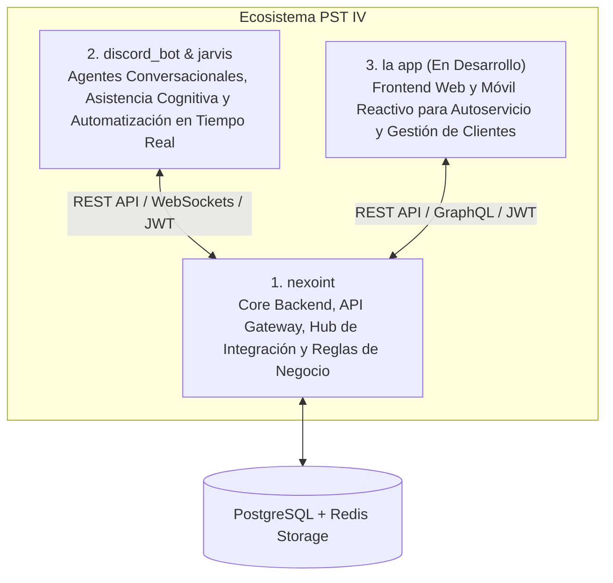

---

## 2. Fase I: Planificación, Diagnóstico y Modelo de Negocio

### 2.1 Contexto y Diagnóstico Situacional Participativo
- **Organización:** ERP Consultores y Asociados C.A.
- **Ámbito:** Consultoría tecnológica, parametrización de ERPs, soporte corporativo a sistemas empresariales y desarrollo de software a medida.
- **Diagnóstico Técnico-Operativo:** Tras los avances logrados en los trayectos anteriores (PST II: Activos Fijos y PST III: Sistema SGI / Bot Dory inicial), la empresa experimentó una expansión en su volumen de clientes. Esto evidenció la necesidad de:
  1. Centralizar la lógica transaccional y de autenticación en una plataforma unificada (`nexoint`).
  2. Integrar inteligencia y flujos automáticos más robustos mediante agentes inteligentes (`jarvis` y `discord_bot`).
  3. Proveer a los clientes de una aplicación moderna (`la app`) con interfaces intuitivas accesibles desde navegadores y dispositivos móviles.

### 2.2 Modelo de Negocio de ERP Consultores y Asociados C.A.

El modelo de negocio de la empresa se sustenta en la prestación de servicios de software bajo esquemas de suscripción, bolsas de horas de consultoría y proyectos de desarrollo a medida.

| Bloque del Modelo | Descripción Aplicada al Proyecto |
| :--- | :--- |
| **Propuesta de Valor** | Plataforma integral de gestión de servicios con soporte reactivo y proactivo asistido por IA, visibilidad 24/7 de horas consumidas y SLAs garantizados. |
| **Segmento de Clientes** | Empresas medianas y grandes que utilizan sistemas ERP (ADempiere, Odoo u homólogos) y requieren mantenimiento, consultoría y soporte especializado. |
| **Canales de Interacción** | • `discord_bot`: Canal ágil de soporte técnico y chats dedicados por cliente. • `la app`: Portal web y móvil para autoservicio, dashboard financiero y ticketing. • `jarvis`: Asistencia proactiva interna para el equipo de consultores. |
| **Relación con Clientes** | Automatizada y personalizada, con trazabilidad milimétrica de casos, tiempos de respuesta y reportes de desempeño. |
| **Fuentes de Ingresos** | Venta de planes mensuales de soporte técnico, horas de consultoría certificada, desarrollo de extensiones ERP e implementaciones. |
| **Actividades Clave** | Desarrollo continuo de microservicios, soporte técnico nivel 1, 2 y 3, monitoreo de infraestructura, análisis de datos de servicio. |
| **Recursos Clave** | Infraestructura en la nube / contenedores Docker, bases de datos PostgreSQL, APIs de comunicación, equipo humano de desarrollo y consultoría. |
| **Socios Clave** | Comunidades de Software Libre, proveedores de infraestructura cloud, proveedores de modelos de lenguaje / IA. |
| **Estructura de Costos** | Alojamiento en servidores, ancho de banda, licencias de APIs externas, nómina de consultores y costos operativos de mantenimiento. |

### 2.3 Mapa y Flujograma de Procesos de Negocio

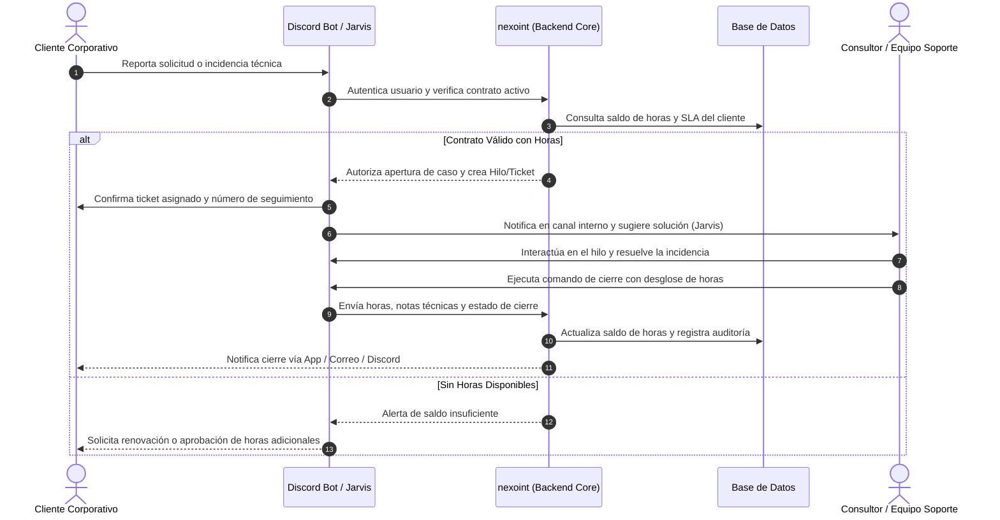

### 2.4 Diagrama de Casos de Uso del Negocio (CUN)

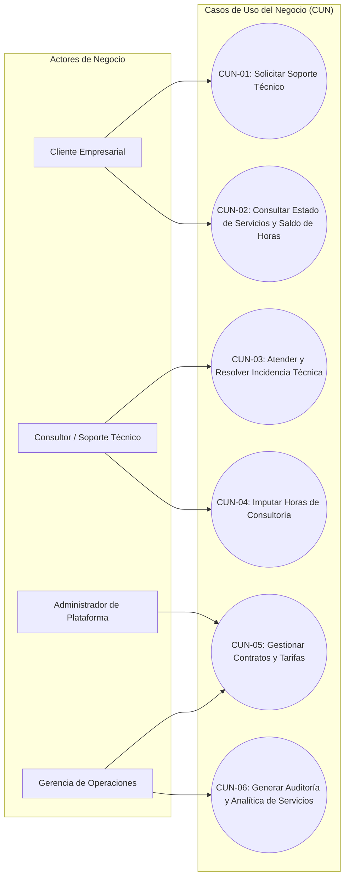

### 2.5 Matriz FODA y Árbol del Problema

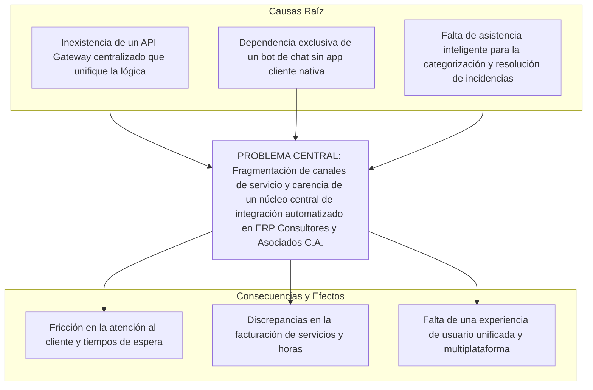

---

## 3. Fase II: Requerimientos, Diseño y Nueva Arquitectura de Software

### 3.1 Visión Arquitectónica General

La arquitectura del ecosistema PST IV se fundamenta en un patrón **Modular / Microservicios con API Gateway**, donde cada componente cumple un rol especializado y se comunica mediante protocolos estándar (HTTP/REST, WebSockets y gRPC):

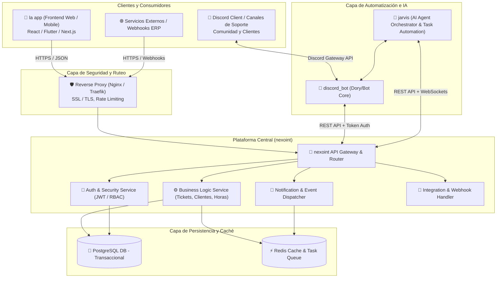

---

### 3.2 Pilar 1: `nexoint` (Core Backend, Seguridad & Hub de Integración)

`nexoint` constituye el **cerebro y núcleo de operaciones** de todo el ecosistema. Es la plataforma integral de backend y administración construida con React, TypeScript, TailwindCSS y conectada al motor de base de datos en la nube **Supabase (PostgreSQL 16 en el esquema `dory`)**, encargada de orquestar la persistencia de datos, garantizar las reglas de negocio, validar la seguridad y proveer servicios a las aplicaciones satélites.

#### 3.2.1 Arquitectura de Autenticación y Logins Externos
NexoInt integra un sistema de identidad federada multi-proveedor gestionado a través de Supabase Auth:
1. **Google OAuth 2.0 (`GoogleAuthService`):** Inicio de sesión corporativo rápido y seguro con cuentas autorizadas de Google Workspace.
2. **Discord OAuth 2.0 (`DiscordAuthService`):** Vinculación nativa con cuentas de Discord para sincronizar automáticamente el `discord_user_id` de clientes y consultores con su perfil en la base de datos (`dory.dory_user` y `dory.dory_employee`).
3. **Credenciales Clásicas (Email/Password) y Magic Links:** Autenticación por correo y contraseña con requisitos de complejidad, restablecimiento administrativo y políticas de cambio forzado tras primer inicio de sesión.

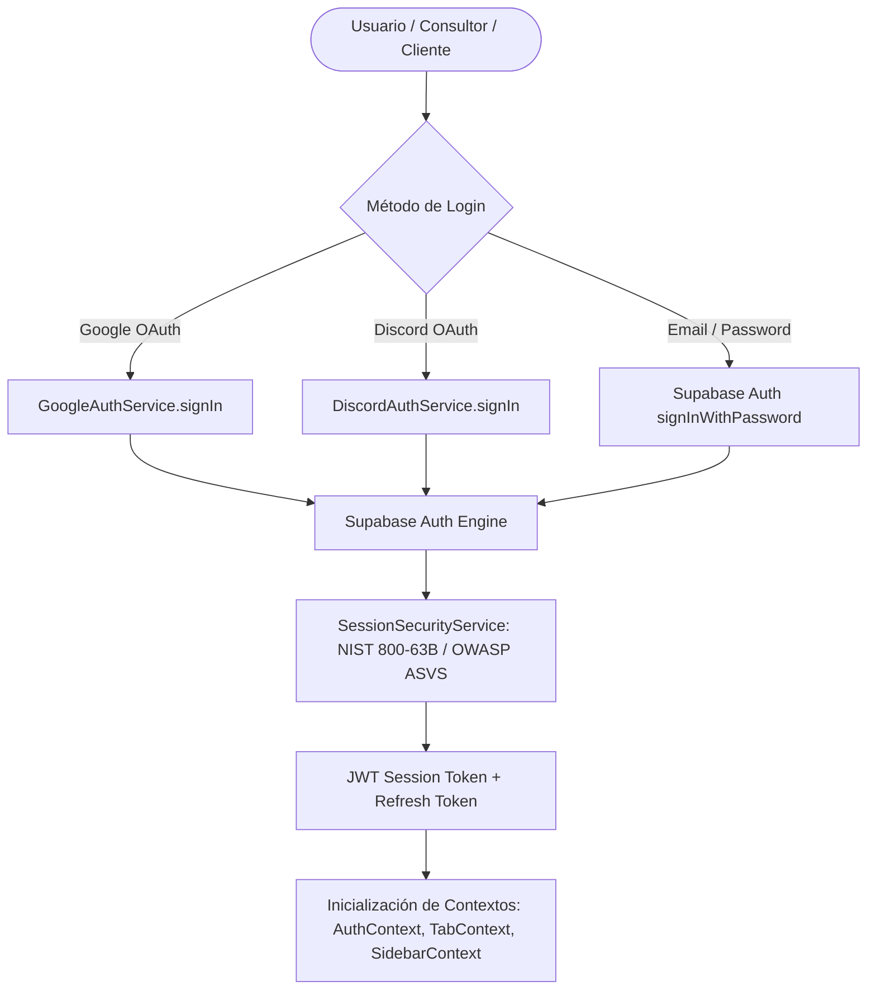

#### 3.2.2 Lógicas de Seguridad Avanzada y Gestión de Sesión (`SessionSecurityService`)
La plataforma implementa estándares de seguridad de nivel bancario basados en las guías **NIST 800-63B** y **OWASP ASVS**:
- **Timeout de Inactividad (30 Minutos):** Monitor de eventos de usuario (teclado, ratón, toques táctiles) con *throttling* a 15 segundos que cierra automáticamente la sesión tras 30 minutos de inactividad.
- **Tiempo de Vida Absoluto de Sesión (12 Horas):** Límite estricto de vigencia de sesión que obliga a reautenticación tras 12 horas consecutivas, evitando sesiones zombies.
- **Sincronización Multi-Pestaña (*Cross-Tab Sync*):** Mediante eventos de `StorageEvent`, cuando un usuario cierra sesión o expira su sesión en una pestaña, todas las demás pestañas abiertas del navegador se desautentican y limpian la memoria instantáneamente.
- **Validación en Arranque en Frío (*Cold-Start Validation*):** Al recargar la aplicación o abrirla tras hibernación, se valida la frescura del token y la vigencia temporal antes de permitir renderizar interfaces privadas.

#### 3.2.3 Control de Acceso Basado en Roles (RBAC Dinámico)
El sistema abandona los roles estáticos cableados en código y adopta una matriz de permisos granular por ventanas:
- **Catálogo de Ventanas (`dory.dory_window`):** Cada módulo (Tickets, Empleados, Clientes, Contratos, Imputación de Horas, Repositorios) posee un identificador único (*slug*).
- **Matriz de Permisos (`dory.dory_role_permissions`):** Asignación por rol de permisos booleanos independientes:
  - `can_read`: Lectura / Visualización.
  - `can_write`: Creación y Actualización.
  - `can_delete`: Eliminación física o lógica.
  - `can_export`: Descarga de reportes en Excel / PDF.
  - `only_own_records`: Restricción estricta de visibilidad exclusivamente a los registros creados o asignados al usuario actual.

---

### 3.3 Pilar 2: `discord_bot` y `jarvis` (Automatización Inteligente y Soporte Cognitivo)

Este componente conforma el **subsistema conversacional y de automatización inteligente**, brindando una interfaz ágil en tiempo real para clientes y consultores conectada a la API de **Jarvis** (`http://app-server-4.erpcya.com:3000/api`).

#### 3.3.1 Orquestador de Inteligencia Artificial `jarvis`:
- **Generación Automatizada de Notas de Versión (*Release Notes*):** Orquestación de releases de software (`dory_jarvis_release_run`) analizando commits y PRs con plantillas estructuradas de prompt para repositorios Swing y ZK.
- **Asistencia Cognitiva en Casos de Soporte:** Sugiere diagnósticos y categorización de incidencias mediante embeddings y clasificación NLP.
- **Monitoreo de Políticas de Seguimiento (`dory_follow_up_policy`):** Alertas preventivas cuando un caso de soporte permanece inactivo sin respuesta de consultor.

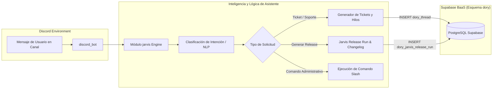

---

### 3.4 Modelo de Datos Relacional y Esquema `dory`

> [!IMPORTANT]
> El modelo de datos completo, diccionario de más de 25 entidades relacionales, diagramas ER por subdominios y funciones RPC se encuentran documentados exhaustivamente en:  
> 🔗 [**Documentación del Modelo de Base de Datos NexoInt (Esquema `dory`)**](../database/README.md)

#### Funcionalidades Clave de `discord_bot`:
- **Comandos Slash (`/`):** Comandos estructurados como `/ticket open`, `/ticket close`, `/horas balance`, `/status`, `/asignar`.
- **Hilos Automáticos (*Threads*):** Al abrir una incidencia, se genera un hilo privado o dedicado que mantiene limpia la conversación y asocia todos los mensajes al ticket.
- **Sincronización en Tiempo Real:** Todos los mensajes de valor técnico y archivos adjuntos quedan registrados en el ticket dentro de `nexoint`.

#### Funcionalidades Clave de `jarvis`:
- **Asistencia Cognitiva al Consultor:** Sugiere posibles causas de fallas y soluciones basadas en el histórico de tickets similares resueltos en el pasado.
- **Detección Automática de Urgencia y Tópicos:** Clasifica automáticamente la criticidad de las incidencias recibidas.
- **Automatización de Notificaciones:** Alerta proactivamente a la gerencia sobre tickets con riesgo de vencer su SLA.

---

### 3.4 Pilar 3: `la app` (Cliente Web y Móvil Multiplataforma - En Desarrollo)

`la app` es la interfaz gráfica moderna para usuarios finales, clientes corporativos y administradores, diseñada para complementar y expandir los canales de chat.

#### Módulos de `la app`:
1. **Portal de Autoservicio del Cliente:**
   - Visualización de incidencias activas e históricas con línea de tiempo (*timeline*) de actividades.
   - Gráfico de barras y dona con el consumo mensual de horas frente al total contratado.
   - Creación de tickets con adjuntos multimedia y solicitud de ampliación de horas.
2. **Panel de Control del Consultor:**
   - Bandeja Kanban de tareas y tickets asignados (To Do, In Progress, In Review, Done).
   - Temporizador de trabajo (*timer*) para imputación precisa de tiempo de soporte.
3. **Consola de Administración y Gerencia:**
   - Métricas en tiempo real de rendimiento del equipo, tiempos de primera respuesta y satisfacción de clientes.
   - Administración de empresas clientes, contratos y tarifas.

---

### 3.5 Diagrama de Interacción y Flujo de Datos Global

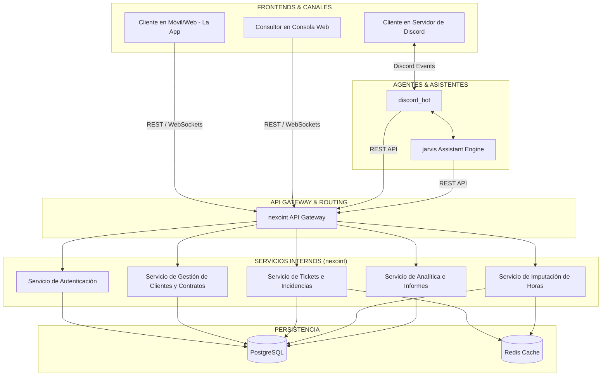

---

### 3.6 Diagrama de Componentes y Despliegue

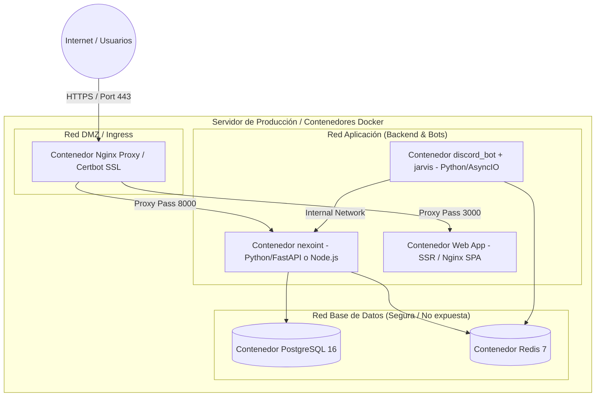

---

### 3.7 Modelo de Datos Relacional y Esquema de Entidades

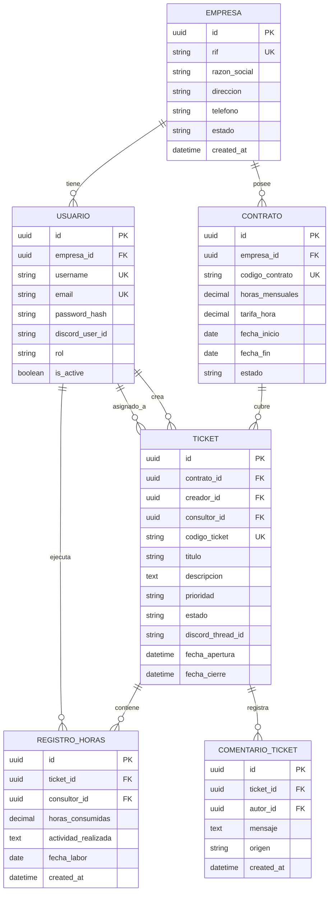

---

## 4. Fase III: Estrategias de Implantación, Pruebas y Auditoría Informática

### 4.1 Plan de Pruebas Automatizadas y de Integración

| Nivel de Prueba | Alcance y Herramientas | Criterio de Éxito |
| :--- | :--- | :--- |
| **Pruebas Unitarias** | Validación de funciones de negocio de `nexoint`, cálculo de horas y endpoints individuales con `pytest` / `jest`. | Cobertura de código superior al 85%. |
| **Pruebas de Integración** | Simulación del ciclo completo: Mensaje en Discord -> `discord_bot` -> `nexoint` -> PostgreSQL -> Actualización en `la app`. | 100% de coherencia en estados y persistencia sin pérdidas de datos. |
| **Pruebas de Carga y Rendimiento** | Pruebas de estrés a la API de `nexoint` simulando 500 solicitudes concurrentes con `Locust` o `K6`. | Tiempo de respuesta p95 < 250 ms con 0% de errores HTTP 5xx. |
| **Pruebas de Aceptación (UAT)** | Validación directa con el personal de ERP Consultores y Asociados C.A. y clientes de prueba. | Firma de conformidad y usabilidad satisfactoria. |

### 4.2 Plan de Auditoría Informática y Seguridad
De acuerdo con el esquema PST IV 2018, se debe incluir un **Informe de Resultados de Auditoría Informática**:
1. **Análisis de Vulnerabilidades:** Evaluación con herramientas estáticas (SAST: SonarQube, Bandit) y dinámicas (DAST: OWASP ZAP).
2. **Auditoría de Control de Accesos:** Verificación de integridad de tokens JWT, expiración forzada y validación estricta de roles RBAC.
3. **Auditoría de Base de Datos:** Verificación de políticas de respaldo automatizado diario (`pg_dump` con cifrado) y planes de recuperación ante desastres (RPO < 2 horas, RTO < 30 minutos).

---

## 5. Fase IV: Resultados, Diagrama de Red y Evaluación Integral de Riesgos

### 5.1 Diagrama Físico y Lógico de la Red

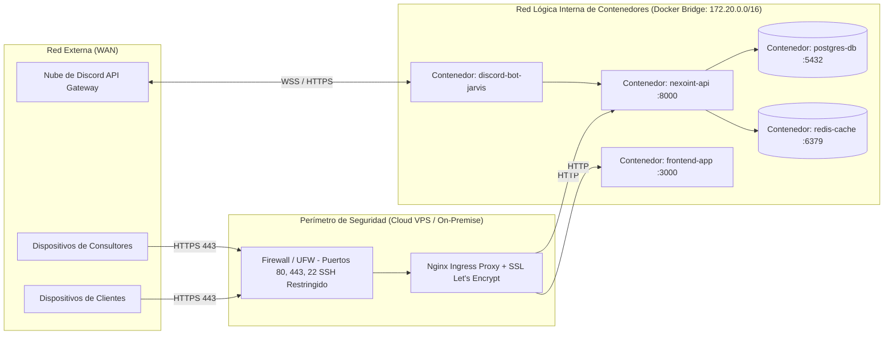

### 5.2 Matriz de Factores y Evaluación de Riesgos

| Factor de Riesgo | Tipo | Nivel | Estrategia de Mitigación / Plan de Contingencia |
| :--- | :--- | :---: | :--- |
| **Caídas en API de Discord** | Tecnológico / Externo | Medio | `la app` opera de forma autónoma con su propio chat y sistema de tickets directo con `nexoint`. |
| **Pérdida de Fluido Eléctrico / Red Local** | Operativo / Físico | Alto | Despliegue de los servicios en Servidor Privado Virtual (VPS en la nube) con alta disponibilidad y UPS en sucursales locales. |
| **Filtración de Datos de Contratos** | Seguridad / Legal | Crítico | Cifrado de datos en reposo y en tránsito (TLS 1.3), tokens firmados con claves asimétricas y auditoría de eventos. |
| **Resistencia al Cambio de Usuarios** | Social / Humano | Bajo | Jornadas de capacitación programadas y diseño centrado en la experiencia de usuario (UI/UX) simplificada. |
| **Variación de Costos de Infraestructura** | Financiero | Bajo | Utilización de software 100% de código abierto (PostgreSQL, Docker, Linux, Python/JS) sin licenciamiento privativo. |

---

## 6. Fase V: Estructura de Manuales y Políticas de Seguridad

De acuerdo con el esquema oficial de PST IV, el informe final debe incorporar:
1. **Manual de Usuario:** Guía ilustrada para clientes (uso de `la app` y comandos de Discord) y consultores (atención, registro de horas).
2. **Manual de Sistemas:** Documentación técnica de arquitectura, endpoints Swagger/OpenAPI, diagramas E/R y contratos de microservicios.
3. **Manual de Instalación:** Instrucciones paso a paso para desplegar el ecosistema mediante Docker Compose (`docker compose up -d`) y variables de entorno `.env`.
4. **Manual de Normas y Procedimientos:** Procedimientos operativos estandarizados para alta de clientes, cierre de mes contable y resolución de incidencias.
5. **Políticas y Estándares de Seguridad Informática:**
   - *Seguridad Física:* Control de acceso a servidores locales y terminales de trabajo.
   - *Seguridad Lógica:* Política de contraseñas robustas, rotación periódica de tokens y llaves API, y política de copias de seguridad redundantes.

---

## 7. Guía Metodológica y Asignación de Tareas para la Redacción del Informe

> [!IMPORTANT]
> **Propósito de esta Documentación:**  
> Este documento técnico, junto con el [Modelo de Base de Datos](../database/README.md) y los diagramas generados, constituye la **base de ingeniería y arquitectura** del proyecto. El objetivo es que los demás integrantes del equipo de proyecto tomen estos insumos como punto de partida y se encarguen de la **redacción académica, justificación teórica y desarrollo de los capítulos del informe final** exigido por la coordinación del PNFI.

### 7.1 Matriz de Tareas y Qué Debe Redactar el Equipo por Fase

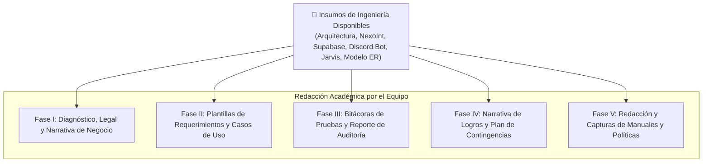

---

### 7.2 Detalle de Responsabilidades de Redacción

#### 📝 Fase I: Planificación del Proyecto y Diagnóstico Situacional
- **Qué tienen listo como base:** El modelo de negocio CANVAS, los actores clave, el árbol del problema y la matriz FODA estructurada en este documento.
- **Qué debe redactar el equipo:**
  1. *Antecedentes y Reseña Histórica:* Expandir la historia y organigrama de ERP Consultores y Asociados C.A.
  2. *Fundamentación Legal:* Redactar la justificación articulada con la **Constitución de la República Bolivariana de Venezuela (Art. 110)**, la **Ley de Infogobierno**, el **Plan de la Patria (Objetivos Históricos y Nacionales)** y el **Decreto 3.390 sobre Software Libre**.
  3. *Factibilidad:* Redactar el análisis descriptivo de factibilidad social, económica, operativa y técnica.
  4. *Narrativa del Problema:* Convertir el árbol de problemas y la matriz FODA en párrafos narrativos fluidos y contextualizados.

---

#### 📝 Fase II: Requerimientos, Diseño y Desarrollo del Software
- **Qué tienen listo como base:** La arquitectura modular (`nexoint`, `discord_bot`/`jarvis`, `la app`), los esquemas de bases de datos `dory`, el flujo de eventos, la seguridad OWASP/NIST y los logins externos.
- **Qué debe redactar el equipo:**
  1. *Plantillas de Requerimientos Funcionales y No Funcionales:* Llenar cada ficha oficial del PNFI (ID, Nombre, Descripción detallada, Prioridad, Actor) para los módulos de Tickets, Contratos, Imputación de Horas, Seguridad y Releases.
  2. *Plantillas de Casos de Uso del Software (CUS):* Elaborar las planillas de especificación de casos de uso maestros (Gestión de Clientes, Contratos, Usuarios) y transaccionales (Apertura de Ticket por Discord, Imputación de Horas, Ejecución de Release con Jarvis).
  3. *Justificación Metodológica:* Redactar la justificación del uso de la metodología **MeRinde** combinada con prácticas ágiles y el estándar de calidad **RECLAMO**.
  4. *Interfaces de Usuario:* Adjuntar capturas de pantalla de los formularios de `nexoint` y maquetas de `la app` con sus descripciones funcionales.

---

#### 📝 Fase III: Implantación, Pruebas y Auditoría Informática
- **Qué tienen listo como base:** El plan de pruebas unitarias, de integración, rendimiento y el alcance de auditoría informática.
- **Qué debe redactar el equipo:**
  1. *Casos de Prueba Detallados:* Llenar las tablas de casos de prueba con: Entrada de datos, Pasos de ejecución, Resultado esperado y Resultado obtenido (con capturas de pantalla de logs o respuestas de la API).
  2. *Informe de Auditoría Informática:* Redactar el informe formal de auditoría explicando las herramientas utilizadas (SAST, DAST, análisis de endpoints, revisión de base de datos) y emitiendo el dictamen y recomendaciones.
  3. *Análisis de Métricas:* Redactar la interpretación cualitativa y cuantitativa de las métricas de software obtenidas.

---

#### 📝 Fase IV: Resultados y Logros del Proyecto
- **Qué tienen listo como base:** El diagrama lógico/físico de red, la topología de contenedores Docker/Supabase y la matriz de factores de riesgo.
- **Qué debe redactar el equipo:**
  1. *Descripción del Producto:* Redactar la memoria descriptiva final explicando cómo el ecosistema resuelve la problemática diagnosticada en la Fase I y mejora el desempeño de la empresa.
  2. *Plan de Contingencia de Riesgos:* Desarrollar los párrafos explicativos de cada factor de riesgo (financiero, técnico, ambiental, legal) y su protocolo de mitigación.

---

#### 📝 Fase V: Manuales y Normativas
- **Qué tienen listo como base:** El índice y estructura de contenidos requeridos por el esquema 2018.
- **Qué debe redactar el equipo:**
  1. *Manual de Usuario:* Redactar la guía ilustrada paso a paso con capturas para el cliente (cómo abrir tickets por Discord / Web) y para el consultor (cómo registrar horas y cerrar tickets).
  2. *Manual de Sistemas:* Compilar los contratos de endpoints OpenAPI/Swagger, variables de entorno y diagramas de bases de datos.
  3. *Manual de Instalación:* Guía de despliegue paso a paso para desarrolladores (`pnpm install`, `.env`, conexión a Supabase y Docker Compose).
  4. *Manual de Normas y Procedimientos:* Protocolos operativos internos de soporte y atención.
  5. *Políticas de Seguridad Informática:* Documento formal con las políticas de contraseñas, control de accesos RBAC y respaldo de información.

---

### 7.3 Checklist de Verificación para la Entrega Final

Antes de la entrega del informe final a la coordinación del PNFI y tutores, el equipo debe verificar:

- [ ] ¿Todas las fases I a V siguen la estructura exacta del [Esquema PST 2018](../esquemas-pst-2018.md#4-proyecto-socio-tecnológico-iv-trayecto-iv)?
- [ ] ¿Se utilizaron las plantillas oficiales para los Requerimientos Funcionales y No Funcionales?
- [ ] ¿Las especificaciones de casos de uso tienen sus diagramas de secuencia/actividad asociados?
- [ ] ¿El modelo de base de datos coincide con el [Diccionario de Datos del Esquema `dory`](../database/README.md)?
- [ ] ¿Se incluyeron todas las reflexiones críticas al final de cada fase?
- [ ] ¿Los manuales de usuario, sistemas, instalación y seguridad cuentan con imágenes y texto explicativo claro?
