# Proyecto Socio Tecnológico IV (Trayecto IV) - Nueva Arquitectura y Modelo de Negocio

> **Documento de Especificación Arquitectónica y Guía para el Informe de Proyecto Socio Tecnológico IV**  
> **Institución:** Universidad Politécnica Territorial del Estado Portuguesa "Juan de Jesús Montilla" (UPTEP JJ Montilla)  
> **Programa:** Programa Nacional de Formación en Informática (PNFI)  
> **Organización Beneficiaria:** ERP Consultores y Asociados C.A.  
> **Ecosistema Tecnológico:** `nexoint` | `discord_bot` (y `jarvis`) | `la app` (Frontend en desarrollo)  
> **Referencia Metodológica:** [Esquemas de PST 2018 - Trayecto IV](../esquemas-pst-2018.md#4-proyecto-socio-tecnológico-iv-trayecto-iv)

---

## Tabla de Contenidos

- [Proyecto Socio Tecnológico IV (Trayecto IV) - Nueva Arquitectura y Modelo de Negocio](#proyecto-socio-tecnológico-iv-trayecto-iv---nueva-arquitectura-y-modelo-de-negocio)
  - [Tabla de Contenidos](#tabla-de-contenidos)
  - [1. Introducción y Visión General del Proyecto](#1-introducción-y-visión-general-del-proyecto)
  - [2. Fase I: Planificación, Diagnóstico y Modelo de Negocio](#2-fase-i-planificación-diagnóstico-y-modelo-de-negocio)
    - [2.1 Contexto y Diagnóstico Situacional Participativo](#21-contexto-y-diagnóstico-situacional-participativo)
    - [2.2 Modelo de Negocio de ERP Consultores y Asociados C.A.](#22-modelo-de-negocio-de-erp-consultores-y-asociados-ca)
    - [2.3 Mapa y Flujograma de Procesos de Negocio](#23-mapa-y-flujograma-de-procesos-de-negocio)
    - [2.4 Diagrama de Casos de Uso del Negocio (CUN)](#24-diagrama-de-casos-de-uso-del-negocio-cun)
    - [2.5 Matriz FODA y Árbol del Problema](#25-matriz-foda-y-árbol-del-problema)
  - [3. Fase II: Requerimientos, Diseño y Nueva Arquitectura de Software](#3-fase-ii-requerimientos-diseño-y-nueva-arquitectura-de-software)
    - [3.1 Visión Arquitectónica General](#31-visión-arquitectónica-general)
    - [3.2 Pilar 1: `nexoint` (Core Backend \& Integration Gateway)](#32-pilar-1-nexoint-core-backend--integration-gateway)
    - [3.3 Pilar 2: `discord_bot` y `jarvis` (Automatización Inteligente y Soporte Cognitivo)](#33-pilar-2-discord_bot-y-jarvis-automatización-inteligente-y-soporte-cognitivo)
    - [3.4 Pilar 3: `la app` (Cliente Web y Móvil Multiplataforma - En Desarrollo)](#34-pilar-3-la-app-cliente-web-y-móvil-multiplataforma---en-desarrollo)
    - [3.5 Diagrama de Interacción y Flujo de Datos Global](#35-diagrama-de-interacción-y-flujo-de-datos-global)
    - [3.6 Diagrama de Componentes y Despliegue](#36-diagrama-de-componentes-y-despliegue)
    - [3.7 Modelo de Datos Relacional y Esquema de Entidades](#37-modelo-de-datos-relacional-y-esquema-de-entidades)
  - [4. Fase III: Estrategias de Implantación, Pruebas y Auditoría Informática](#4-fase-iii-estrategias-de-implantación-pruebas-y-auditoría-informática)
    - [4.1 Plan de Pruebas Automatizadas y de Integración](#41-plan-de-pruebas-automatizadas-y-de-integración)
    - [4.2 Plan de Auditoría Informática y Seguridad](#42-plan-de-auditoría-informática-y-seguridad)
  - [5. Fase IV: Resultados, Diagrama de Red y Evaluación Integral de Riesgos](#5-fase-iv-resultados-diagrama-de-red-y-evaluación-integral-de-riesgos)
    - [5.1 Diagrama Físico y Lógico de la Red](#51-diagrama-físico-y-lógico-de-la-red)
    - [5.2 Matriz de Factores y Evaluación de Riesgos](#52-matriz-de-factores-y-evaluación-de-riesgos)
  - [6. Fase V: Estructura de Manuales y Políticas de Seguridad](#6-fase-v-estructura-de-manuales-y-políticas-de-seguridad)
  - [7. Guía de Redacción para el Equipo de Proyecto](#7-guía-de-redacción-para-el-equipo-de-proyecto)

---

## 1. Introducción y Visión General del Proyecto

El **Trayecto IV del Programa Nacional de Formación en Informática (PNFI)** representa la cúspide académica y técnica del perfil de Ingeniería en Informática. En este trayecto, el proyecto evoluciona desde sistemas aislados o de soporte básico hacia un **Ecosistema Digital Modular, Distribuido e Inteligente**, capaz de gestionar la totalidad de las operaciones de servicios tecnológicos de la empresa **ERP Consultores y Asociados C.A.**

El proyecto actual aborda la concepción, diseño, implementación y despliegue de una plataforma modular desacoplada en tres componentes sinérgicos:

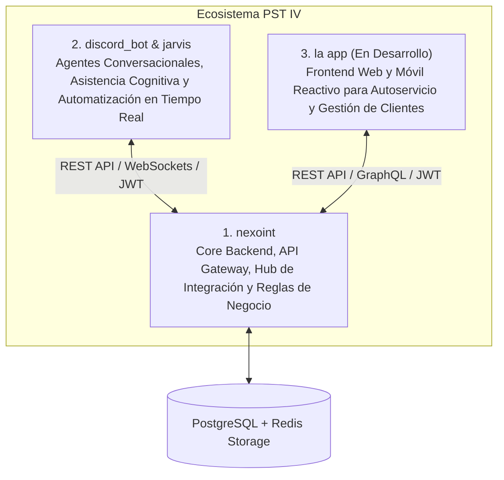
```mermaid
flowchart TD
    subgraph sub_Ecosistema_PST_IV ["Ecosistema PST IV"]
        A["1. nexoint<br>Core Backend, API Gateway, Hub de Integración y Reglas de Negocio"]
        B["2. discord_bot & jarvis<br>Agentes Conversacionales, Asistencia Cognitiva y Automatización en Tiempo Real"]
        C["3. la app (En Desarrollo)<br>Frontend Web y Móvil Reactivo para Autoservicio y Gestión de Clientes"]
    end

    B <-->|REST API / WebSockets / JWT| A
    C <-->|REST API / GraphQL / JWT| A
    A <--> DB[("PostgreSQL + Redis Storage")]
```

---

## 2. Fase I: Planificación, Diagnóstico y Modelo de Negocio

### 2.1 Contexto y Diagnóstico Situacional Participativo
- **Organización:** ERP Consultores y Asociados C.A.
- **Ámbito:** Consultoría tecnológica, parametrización de ERPs, soporte corporativo a sistemas empresariales y desarrollo de software a medida.
- **Diagnóstico Técnico-Operativo:** Tras los avances logrados en los trayectos anteriores (PST II: Activos Fijos y PST III: Sistema SGI / Bot Dory inicial), la empresa experimentó una expansión en su volumen de clientes. Esto evidenció la necesidad de:
  1. Centralizar la lógica transaccional y de autenticación en una plataforma unificada (`nexoint`).
  2. Integrar inteligencia y flujos automáticos más robustos mediante agentes inteligentes (`jarvis` y `discord_bot`).
  3. Proveer a los clientes de una aplicación moderna (`la app`) con interfaces intuitivas accesibles desde navegadores y dispositivos móviles.

### 2.2 Modelo de Negocio y Reglas Operativas de ERP Consultores y Asociados C.A.

El modelo de negocio de la empresa se sustenta en la prestación de servicios de software bajo esquemas de suscripción, bolsas de horas de consultoría y proyectos de desarrollo a medida.

| Bloque del Modelo | Descripción Aplicada al Proyecto |
| :--- | :--- |
| **Propuesta de Valor** | Plataforma integral de gestión de servicios con soporte reactivo y proactivo asistido por IA, visibilidad 24/7 de horas consumidas y SLAs garantizados. |
| **Segmento de Clientes** | Empresas medianas y grandes que utilizan sistemas ERP (ADempiere, Odoo u homólogos) y requieren mantenimiento, consultoría y soporte especializado. |
| **Canales de Interacción** | • `discord_bot`: Canal ágil de soporte técnico y chats dedicados por cliente.<br>• `la app`: Portal web y móvil para autoservicio, dashboard financiero y ticketing.<br>• `jarvis`: Asistencia proactiva interna para el equipo de consultores. |
| **Relación con Clientes** | Automatizada y personalizada, con trazabilidad milimétrica de casos, tiempos de respuesta y reportes de desempeño. |
| **Fuentes de Ingresos** | Venta de planes mensuales de soporte técnico, horas de consultoría certificada, desarrollo de extensiones ERP e implementaciones. |
| **Actividades Clave** | Desarrollo continuo de microservicios, soporte técnico nivel 1, 2 y 3, monitoreo de infraestructura, análisis de datos de servicio. |
| **Recursos Clave** | Infraestructura en la nube / contenedores Docker, bases de datos PostgreSQL en Supabase, APIs de comunicación, equipo humano de desarrollo y consultoría. |
| **Socios Clave** | Comunidades de Software Libre, proveedores de infraestructura cloud, proveedores de modelos de lenguaje / IA. |
| **Estructura de Costos** | Alojamiento en servidores, ancho de banda, licencias de APIs externas, nómina de consultores y costos operativos de mantenimiento. |

#### Reglas de Negocio Clave en el Ecosistema Operativo (Discord ↔ NexoInt ↔ Jarvis):

1. **Jerarquía Organizacional Derivada de Discord:**
   - La maestra de compañías (`dory.dory_client`) y sus sucursales o canales de atención (`dory.dory_channel`) **no se crean de manera manual en NexoInt** (`allowCreate: false` en las entidades del frontend).
   - Estas entidades provienen directamente del árbol de servidores de Discord:
     - **Categoría de Discord** = **Empresa / Cliente** (por ejemplo: `NATULAC`).
     - **Canales de Texto bajo la Categoría** = **Sucursales o Canales de Atención** (por ejemplo: `maros-atencion`, `inalcon-atencion`, `anros-atencion`).
   - El bot de Discord resuelve o registra automáticamente en Supabase la compañía (`client_name`) y la sucursal (`org_name`) al interactuar o crear hilos.

2. **Creación Exclusiva de Tickets / Hilos desde Discord:**
   - Los hilos de soporte (`dory.dory_thread`) **se crean exclusivamente desde Discord** mediante la interacción del cliente o el comando interactivo `/abrir_hilo`.
   - En la interfaz de NexoInt (`ThreadEntity`), la creación manual está deshabilitada (`allowCreate: false`) para garantizar la correspondencia 1:1 entre el hilo de chat y el registro en base de datos.

3. **Integridad Categorial Estricta (`validateCategoryMatch`):**
   - Un ticket (`dory_thread`) **jamás puede pertenecer a un canal cuya categoría en base de datos difiera del cliente asignado**.
   - Si un usuario o proceso intenta vincular un ticket con una empresa cliente A y un canal perteneciente a la empresa cliente B, el sistema detiene la transacción y emite una excepción de coherencia referencial (`ThreadEntity`).

4. **Protección Contra Eliminación de Tickets Enlazados:**
   - Queda prohibida la eliminación física de cualquier ticket que posea trazabilidad activa con Discord (`url`, `discord_identifier`, `dory_thread_status_id` asignado o código mayor a 10 dígitos). El sistema preserva la inmutabilidad histórica y solo admite cambios de estado o archivo lógico.

5. **Alternancia Automática de Turno (`pending_on`) y Sellado de Primera Respuesta:**
   - Cada mensaje dentro de un hilo en Discord recalcula en tiempo real el estado y turno del caso:
     - **Mensaje del Cliente:** Cambia a `pending_on = 'erp'` (requiere atención del equipo consultor) y estatus `ERCYA`.
     - **Mensaje del Consultor:** Se valida la pertenencia al equipo (por rol Discord o registro en `dory_employee`), asignando `pending_on = 'client'` (espera respuesta del cliente) y estatus `ER`.
     - **Sellado Inmutable de Primera Respuesta:** Al responder el consultor por primera vez, se graba `first_erp_response_at = NOW()` para auditoría de SLAs.

6. **Políticas de Nudge, Escalamiento Escalonado (L1 / L2) y Horario Hábil:**
   - Los monitores de escalamiento solo operan en días hábiles (Lunes a Viernes) y horario de oficina en huso horario **Caracas (UTC-4: 08:00 AM a 05:00 PM)**.
   - Si un ticket permanece sin respuesta del consultor, el bot dispara alertas escalonadas L1 y L2 con marcadores Unicode invisibles (`\u200B...`) y bloqueo en memoria para impedir nudges duplicados.

7. **Modalidades de Contratos de Servicio y Generación de Recibos:**
   - Soporte para modelos de facturación por **Bolsas de Horas (`HOURS`)**, **Iguala Mensual (`MONTHLY`)**, **Proyectos (`PROJECT`)** y **Días (`DAYS`)**.
   - Los recibos de servicio (`dory_receipt`) se generan inicialmente en estado Borrador (`DR`); los campos de totales de horas y minutos son de solo lectura agregados a partir de las imputaciones en `dory_charge`.

8. **Integridad Referencial en Estructura de Cargos:**
   - Un perfil de cargo (`dory_charge` como clasificador de puesto) no puede eliminarse si existen consultores o empleados (`dory_employee`) vinculados a él.

9. **Supervisión Humana Obligatoria en Asistencia Cognitiva (`Jarvis`):**
   - Los borradores de notas de versión y documentación técnica sugeridos por IA (`dory_jarvis_release_run`) no pueden emitirse como oficiales ni generar artefactos PDF sin la aprobación y cambio explícito de estado por parte de un ingeniero responsable.

### 2.3 Mapa y Flujograma de Procesos de Negocio

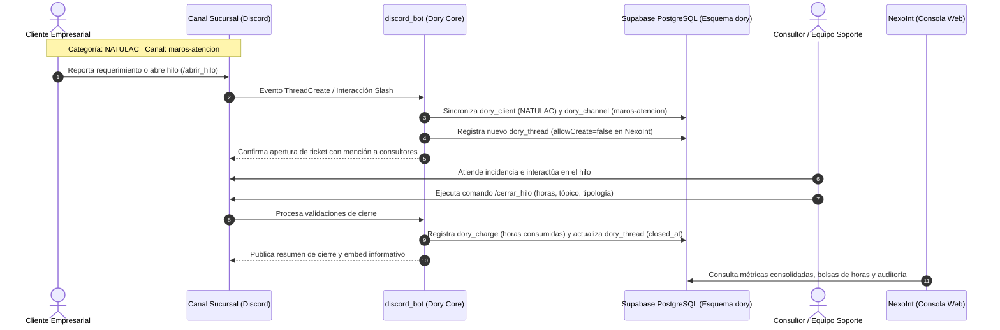
```mermaid
sequenceDiagram
    autonumber
    actor Cliente as Cliente Empresarial
    participant Discord as Canal Sucursal (Discord)
    participant Bot as discord_bot (Dory Core)
    participant DB as Supabase PostgreSQL (Esquema dory)
    actor Soporte as Consultor / Equipo Soporte
    participant Nexo as NexoInt (Consola Web)

    Note over Cliente,Discord: Categoría: NATULAC | Canal: maros-atencion
    Cliente->>Discord: Reporta requerimiento o abre hilo (/abrir_hilo)
    Discord->>Bot: Evento ThreadCreate / Interacción Slash
    Bot->>DB: Sincroniza dory_client (NATULAC) y dory_channel (maros-atencion)
    Bot->>DB: Registra nuevo dory_thread (allowCreate=false en NexoInt)
    Bot-->>Discord: Confirma apertura de ticket con mención a consultores
    Soporte->>Discord: Atiende incidencia e interactúa en el hilo
    Soporte->>Discord: Ejecuta comando /cerrar_hilo (horas, tópico, tipología)
    Discord->>Bot: Procesa validaciones de cierre
    Bot->>DB: Registra dory_charge (horas consumidas) y actualiza dory_thread (closed_at)
    Bot-->>Discord: Publica resumen de cierre y embed informativo
    Nexo->>DB: Consulta métricas consolidadas, bolsas de horas y auditoría
```

### 2.4 Diagrama de Casos de Uso del Negocio (CUN)

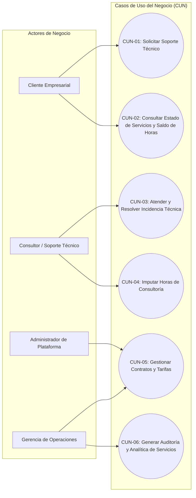
```mermaid
flowchart LR
    subgraph sub_Actores_de_Negocio ["Actores de Negocio"]
        C["Cliente Empresarial"]
        K["Consultor / Soporte Técnico"]
        G["Gerencia de Operaciones"]
        ADM["Administrador de Plataforma"]
    end

    subgraph sub_Casos_de_Uso_del_Negocio_CUN ["Casos de Uso del Negocio (CUN)"]
        CUN1(("CUN-01: Solicitar Soporte Técnico"))
        CUN2(("CUN-02: Consultar Estado de Servicios y Saldo de Horas"))
        CUN3(("CUN-03: Atender y Resolver Incidencia Técnica"))
        CUN4(("CUN-04: Imputar Horas de Consultoría"))
        CUN5(("CUN-05: Gestionar Contratos y Tarifas"))
        CUN6(("CUN-06: Generar Auditoría y Analítica de Servicios"))
    end

    C --> CUN1
    C --> CUN2
    K --> CUN3
    K --> CUN4
    G --> CUN5
    G --> CUN6
    ADM --> CUN5
```

### 2.5 Matriz FODA y Árbol del Problema

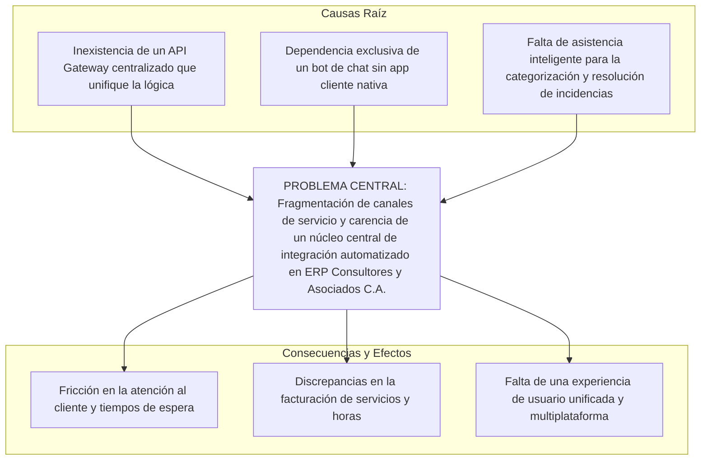
```mermaid
graph TD
    subgraph sub_Consecuencias_y_Efectos ["Consecuencias y Efectos"]
        E1["Fricción en la atención al cliente y tiempos de espera"]
        E2["Discrepancias en la facturación de servicios y horas"]
        E3["Falta de una experiencia de usuario unificada y multiplataforma"]
    end

    P["PROBLEMA CENTRAL: Fragmentación de canales de servicio y carencia de un núcleo central de integración automatizado en ERP Consultores y Asociados C.A."]

    subgraph sub_Causas_Ra_z ["Causas Raíz"]
        C1["Inexistencia de un API Gateway centralizado que unifique la lógica"]
        C2["Dependencia exclusiva de un bot de chat sin app cliente nativa"]
        C3["Falta de asistencia inteligente para la categorización y resolución de incidencias"]
    end

    C1 --> P
    C2 --> P
    C3 --> P
    P --> E1
    P --> E2
    P --> E3
```

---

## 3. Fase II: Requerimientos, Diseño y Nueva Arquitectura de Software

### 3.1 Visión Arquitectónica General

La arquitectura del ecosistema PST IV se fundamenta en un patrón **Modular / Microservicios con API Gateway**, donde cada componente cumple un rol especializado y se comunica mediante protocolos estándar (HTTP/REST, WebSockets y gRPC):

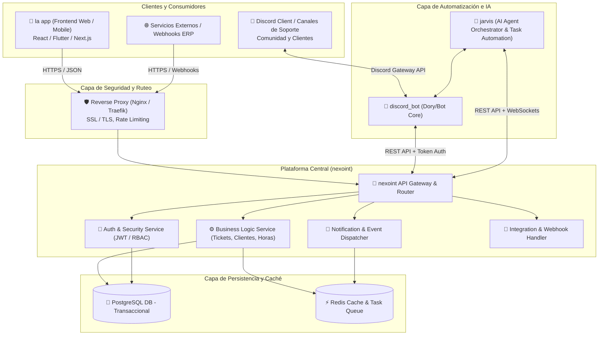
```mermaid
graph TB
    subgraph sub_Clientes_y_Consumidores ["Clientes y Consumidores"]
        APP["📱 la app (Frontend Web / Mobile)<br>React / Flutter / Next.js"]
        DISC["💬 Discord Client / Canales de Soporte<br>Comunidad y Clientes"]
        EXT["🌐 Servicios Externos / Webhooks ERP"]
    end

    subgraph sub_Capa_de_Seguridad_y_Ruteo ["Capa de Seguridad y Ruteo"]
        PROXY["🛡️ Reverse Proxy (Nginx / Traefik)<br>SSL / TLS, Rate Limiting"]
    end

    subgraph sub_Plataforma_Central_nexoint ["Plataforma Central (nexoint)"]
        GW["🚪 nexoint API Gateway & Router"]
        AUTH_SRV["🔐 Auth & Security Service (JWT / RBAC)"]
        CORE_SRV["⚙️ Business Logic Service (Tickets, Clientes, Horas)"]
        NOTIF_SRV["🔔 Notification & Event Dispatcher"]
        INT_SRV["🔌 Integration & Webhook Handler"]
    end

    subgraph sub_Capa_de_Automatizaci_n_e_IA ["Capa de Automatización e IA"]
        BOT["🤖 discord_bot (Dory/Bot Core)"]
        JARVIS["🧠 jarvis (AI Agent Orchestrator & Task Automation)"]
    end

    subgraph sub_Capa_de_Persistencia_y_Cach ["Capa de Persistencia y Caché"]
        DB[("🐘 PostgreSQL DB - Transaccional")]
        REDIS[("⚡ Redis Cache & Task Queue")]
    end

    APP -->|HTTPS / JSON| PROXY
    DISC <-->|Discord Gateway API| BOT
    EXT -->|HTTPS / Webhooks| PROXY
    PROXY --> GW

    GW --> AUTH_SRV
    GW --> CORE_SRV
    GW --> NOTIF_SRV
    GW --> INT_SRV

    BOT <-->|REST API + Token Auth| GW
    JARVIS <-->|REST API + WebSockets| GW
    JARVIS <--> BOT

    CORE_SRV --> DB
    AUTH_SRV --> DB
    CORE_SRV --> REDIS
    NOTIF_SRV --> REDIS
```

---

### 3.2 Pilar 1: `nexoint` (Core Backend, Seguridad & Hub de Integración)

`nexoint` constituye el **cerebro y núcleo de operaciones** de todo el ecosistema. Es la plataforma integral de backend y administración construida con React, TypeScript, TailwindCSS y conectada al motor de base de datos en la nube **Supabase (PostgreSQL 16 en el esquema `dory`)**, encargada de orquestar la persistencia de datos, garantizar las reglas de negocio, validar la seguridad y proveer servicios a las aplicaciones satélites.

#### 3.2.1 Arquitectura de Autenticación y Logins Externos
NexoInt integra un sistema de identidad federada multi-proveedor gestionado a través de Supabase Auth:
1. **Google OAuth 2.0 (`GoogleAuthService`):** Inicio de sesión corporativo rápido y seguro con cuentas autorizadas de Google Workspace.
2. **Discord OAuth 2.0 (`DiscordAuthService`):** Vinculación nativa con cuentas de Discord para sincronizar automáticamente el `discord_user_id` de clientes y consultores con su perfil en la base de datos (`dory.dory_user` y `dory.dory_employee`).
3. **Credenciales Clásicas (Email/Password) y Magic Links:** Autenticación por correo y contraseña con requisitos de complejidad, restablecimiento administrativo y políticas de cambio forzado tras primer inicio de sesión.

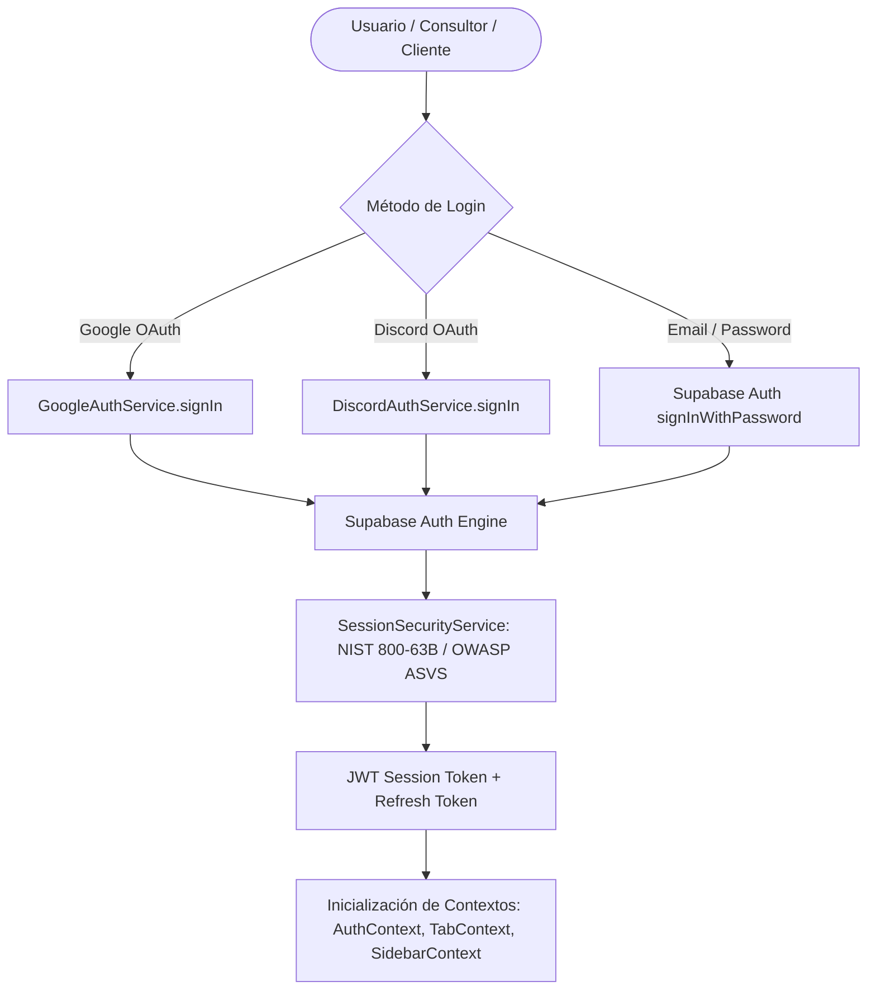
```mermaid
flowchart TD
    User(["Usuario / Consultor / Cliente"]) --> AuthChoice{"Método de Login"}
    AuthChoice -->|Google OAuth| GAuth["GoogleAuthService.signIn"]
    AuthChoice -->|Discord OAuth| DAuth["DiscordAuthService.signIn"]
    AuthChoice -->|Email / Password| PwdAuth["Supabase Auth signInWithPassword"]

    GAuth --> SupaAuth["Supabase Auth Engine"]
    DAuth --> SupaAuth
    PwdAuth --> SupaAuth

    SupaAuth --> SessionSec["SessionSecurityService: NIST 800-63B / OWASP ASVS"]
    SessionSec --> TokenGen["JWT Session Token + Refresh Token"]
    TokenGen --> AppInit["Inicialización de Contextos: AuthContext, TabContext, SidebarContext"]
```

#### 3.2.2 Lógicas de Seguridad Avanzada y Gestión de Sesión (`SessionSecurityService`)
La plataforma implementa estándares de seguridad de nivel bancario basados en las guías **NIST 800-63B** y **OWASP ASVS**:
- **Timeout de Inactividad (30 Minutos):** Monitor de eventos de usuario (teclado, ratón, toques táctiles) con *throttling* a 15 segundos que cierra automáticamente la sesión tras 30 minutos de inactividad.
- **Tiempo de Vida Absoluto de Sesión (12 Horas):** Límite estricto de vigencia de sesión que obliga a reautenticación tras 12 horas consecutivas, evitando sesiones zombies.
- **Sincronización Multi-Pestaña (*Cross-Tab Sync*):** Mediante eventos de `StorageEvent`, cuando un usuario cierra sesión o expira su sesión en una pestaña, todas las demás pestañas abiertas del navegador se desautentican y limpian la memoria instantáneamente.
- **Validación en Arranque en Frío (*Cold-Start Validation*):** Al recargar la aplicación o abrirla tras hibernación, se valida la frescura del token y la vigencia temporal antes de permitir renderizar interfaces privadas.

#### 3.2.3 Control de Acceso Basado en Roles (RBAC Dinámico)
El sistema abandona los roles estáticos cableados en código y adopta una matriz de permisos granular por ventanas:
- **Catálogo de Ventanas (`dory.dory_window`):** Cada módulo (Tickets, Empleados, Clientes, Contratos, Imputación de Horas, Repositorios) posee un identificador único (*slug*).
- **Matriz de Permisos (`dory.dory_role_permissions`):** Asignación por rol de permisos booleanos independientes:
  - `can_read`: Lectura / Visualización.
  - `can_write`: Creación y Actualización.
  - `can_delete`: Eliminación física o lógica.
  - `can_export`: Descarga de reportes en Excel / PDF.
  - `only_own_records`: Restricción estricta de visibilidad exclusivamente a los registros creados o asignados al usuario actual.

---

### 3.3 Pilar 2: `discord_bot` y `jarvis` (Automatización Inteligente y Soporte Cognitivo)

Este componente conforma el **subsistema conversacional y de automatización inteligente**, brindando una interfaz ágil en tiempo real para clientes y consultores conectada a la API de **Jarvis** (`http://app-server-4.erpcya.com:3000/api`).

#### 3.3.1 Orquestador de Inteligencia Artificial `jarvis`:
- **Generación Automatizada de Notas de Versión (*Release Notes*):** Orquestación de releases de software (`dory_jarvis_release_run`) analizando commits y PRs con plantillas estructuradas de prompt para repositorios Swing y ZK.
- **Asistencia Cognitiva en Casos de Soporte:** Sugiere diagnósticos y categorización de incidencias mediante embeddings y clasificación NLP.
- **Monitoreo de Políticas de Seguimiento (`dory_follow_up_policy`):** Alertas preventivas cuando un caso de soporte permanece inactivo sin respuesta de consultor.

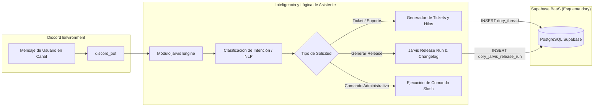
```mermaid
flowchart LR
    subgraph sub_Discord_Environment ["Discord Environment"]
        Msg["Mensaje de Usuario en Canal"] --> Bot["discord_bot"]
    end

    subgraph sub_Inteligencia_y_L_gica_de_Asistente ["Inteligencia y Lógica de Asistente"]
        Bot --> Jarvis["Módulo jarvis Engine"]
        Jarvis --> Intent["Clasificación de Intención / NLP"]
        Intent --> Action{"Tipo de Solicitud"}
        Action -->|Ticket / Soporte| TktGen["Generador de Tickets y Hilos"]
        Action -->|Generar Release| RelGen["Jarvis Release Run & Changelog"]
        Action -->|Comando Administrativo| Cmd["Ejecución de Comando Slash"]
    end

    subgraph sub_Supabase_BaaS_Esquema_dory ["Supabase BaaS (Esquema dory)"]
        TktGen -->|INSERT dory_thread| DB[("PostgreSQL Supabase")]
        RelGen -->|INSERT dory_jarvis_release_run| DB
    end
```

---

### 3.4 Modelo de Datos Relacional y Esquema `dory`

> [!IMPORTANT]
> El modelo de datos completo, diccionario de más de 25 entidades relacionales, diagramas ER por subdominios y funciones RPC se encuentran documentados exhaustivamente en:  
> 🔗 [**Documentación del Modelo de Base de Datos NexoInt (Esquema `dory`)**](../database/README.md)

#### 3.3.2 Funcionalidades y Comandos Slash de `discord_bot`

El bot implementa un conjunto de comandos slash (`/`) fuertemente tipados y auditados que se ejecutan directamente en los hilos o canales de soporte de Discord para gestionar el ciclo de vida de los casos y la imputación de horas:

##### 1. Comando `/cerrar_hilo` (Cierre Operativo e Imputación de Horas)
Es el comando central utilizado por los consultores para formalizar la solución de una incidencia y debitar las horas trabajadas del contrato de soporte correspondiente.
- **Canal de Ejecución:** Debe ejecutarse **dentro del hilo de soporte activo** en Discord.
- **Parámetros:**

| Parámetro | Tipo | Requerido | Descripción / Opciones |
| :--- | :--- | :---: | :--- |
| `solicitante` | Usuario (Discord User) | **SÍ** | Usuario cliente que levantó la incidencia técnica. |
| `topico` | String (Autocomplete) | **SÍ** | Área temática o funcional (ej: `Facturación`, `Ventas`, `Inventario`, `Contabilidad`, `Bancos`, `Nómina`, `Configuración`). |
| `tipologia` | String (Autocomplete) | **SÍ** | Naturaleza técnica del ticket (ej: `CONSULTORIA`, `ERROR_SISTEMA`, `DESARROLLO`, `CAPACITACION`, `CONFIGURACION`). |
| `horas` | Entero (0 - 100) | **SÍ** | Cantidad de horas dedicadas a la resolución. |
| `minutos` | Entero (Choices) | **SÍ** | Fracción de minutos consumidos: opciones fijas `0`, `20` o `30` minutos. |
| `consultor` | Usuario (Discord User) | **SÍ** | Consultor responsable que ejecutó las labores técnicas. |
| `version_erp_afectada` | String (Max 120) | NO | Versión del ERP en la que se presentó el caso (ej: `ZK 11`, `Swing 3.9`). |
| `estatus` | String (Choices) | NO | Estado final de cierre: `PC` (Pendiente Cliente), `PI` (Pendiente Interno), `PR` (Pendiente Release), `PZ` (Pendiente ZK), `PA` (Pendiente Actualización), `ERCYA` (En Revisión CYA), `ER` (En Espera Release), `DP` (Desarrollo Pendiente), `TP` (Testing Pendiente), `CL` (Cerrado - Default). |
| `descripcion` | String (Max 255) | NO | Resumen técnico o justificación de las actividades realizadas. |
| `fecha_cierre` | String (YYYY-MM-DD) | NO | Fecha efectiva de imputación (por defecto, fecha actual). |

> **Ejemplo de Ejecución de `/cerrar_hilo`:**
> ```bash
> /cerrar_hilo solicitante:@carlos_gonzalez topico:Facturación tipologia:CONSULTORIA horas:1 minutos:30 consultor:@jesus_albujas version_erp_afectada:ZK 11 estatus:CL descripcion:Ajuste de correlativo fiscal y validación de libro de ventas fecha_cierre:2026-09-25
> ```
> **Resultado en Base de Datos:**
> - Se actualiza `dory.dory_thread` fijando `closed_at = NOW()`, `dory_thread_status_id` correspondiente a `CL`, `erp_version = 'ZK 11'`.
> - Se inserta un registro en `dory.dory_charge` con `hours_spent = 1.5`, vinculado al contrato activo de la empresa cliente (`NATULAC`), descontando el saldo disponible.
> - Se emite un mensaje enriquecido (*Embed*) en el hilo resumiendo el cargo y archivando el hilo.

---

##### 2. Comando `/abrir_hilo` (Apertura Formal de Incidencia)
Permite a los usuarios o consultores iniciar un ticket de manera guiada y categorizada.
- **Flujo Interactivo:**
  1. El usuario ejecuta `/abrir_hilo`.
  2. El bot despliega un selector interactivo para definir la visibilidad: **Público** (visible para todo el canal de la sucursal) o **Privado** (hilo privado restringido a consultores y solicitante).
  3. Despliega un formulario modal donde se ingresa el **Título del Requerimiento** y el **Solicitante**.
  4. Opcionalmente permite adjuntar el enlace o ID de un mensaje previo del canal para conservar el contexto.
- **Acción en Base de Datos:**
  - Resuelve la empresa (`dory_client`) mediante la categoría del canal de Discord (ej: `NATULAC`).
  - Resuelve la sucursal (`dory_channel`) mediante el nombre del canal (ej: `maros-atencion`).
  - Inserta el ticket en `dory.dory_thread` con estado inicial `ABIERTO` y asigna el `discord_thread_id`.

---

##### 3. Comando `/actualizar_hilo` (Modificación de Estado en Curso)
Permite cambiar el estado de avance de un ticket sin cerrarlo ni imputar horas definitivas.
- **Canal de Ejecución:** Dentro del hilo activo.
- **Parámetros:**
  - `estatus` (**Requerido** - Autocomplete): Nuevo estado operativo (ej: `PC`, `PI`, `PR`, `DP`, `TP`).
  - Parámetros opcionales: `titulo`, `solicitante`, `topico`, `tipologia`, `horas`, `minutos`, `descripcion`, `consultor`, `pendiente_por` (`CLIENTE` o `CONSULTOR`), `issue` (enlace al ticket de Jira / GitHub).

---

##### 4. Comando `/asignar_consultor` (Derivación y Notificación Inteligente)
Asigna el ticket a un consultor técnico específico del equipo.
- **Parámetros:**
  - `consultor` (**Requerido** - Autocomplete): Selecciona al consultor de la lista activa de `dory.dory_employee`.
- **Efecto Operativo:**
  - Actualiza `dory.dory_thread.dory_employee_id`.
  - El bot invoca al motor cognitivo (`DeepSeek` o plantilla de Jarvis) para redactar una notificación cordial y técnica dentro del hilo, informando al cliente sobre la asignación del especialista.

---

##### 5. Comando `/agendar` (Compromisos y Seguimiento de Tareas)
Programa una reunión o sesión de trabajo remoto con el cliente.
- **Parámetros:** `fecha` (YYYY-MM-DD), `hora` (HH:MM), `descripcion` (Opcional).

---

##### 6. Comando `/auditoria_hilos` (Verificación Administrativa)
Ejecuta un barrido de consistencia entre los hilos existentes en los canales de atención y los registros indexados en `dory.dory_thread`, identificando hilos huérfanos o desfasados.

---

#### 3.3.3 Tickets Internos (`is_internal_request`) y Reglas de Exclusión de SLAs
En la operativa diaria de ERP Consultores y Asociados C.A., surgen requerimientos que no corresponden a clientes externos sino a coordinaciones internas, mantenimiento de infraestructura propia, soporte de sistemas internos o investigación de desarrollo.

Para gestionar estos casos sin distorsionar las métricas de atención a clientes:
1. **Detección Automática por Canal:**
   - La tabla `dory.dory_bot_settings` almacena el parámetro dinámico `internal_request_channel_id` (con caché en memoria de 5 minutos en el bot).
   - Cuando se abre un hilo en dicho canal interno, el bot marca automáticamente el campo en base de datos:
     ```sql
     dory.dory_thread.is_internal_request = 'Y'
     ```
2. **Exclusión de Escalamientos y Recordatorios (*Idle Nudge*):**
   - El subsistema de alarmas de inactividad (`idleNudgeHandler.ts`) y el monitor de escalamiento de SLAs en tiempo real (`realtimeEscalation.ts`) filtran expresamente estos casos:
     ```sql
     WHERE COALESCE(t.is_internal_request, 'N') <> 'Y'
     ```
   - De este modo, los tickets internos **no generan alertas automáticas de SLA ni nudges por falta de respuesta**, permitiendo una gestión flexible sin penalizar los índices de servicio a clientes.

---

### 3.4 Pilar 3: `la app` (Cliente Web y Móvil Multiplataforma - En Desarrollo)

`la app` es la interfaz gráfica moderna para usuarios finales, clientes corporativos y administradores, diseñada para complementar y expandir los canales de chat.

#### Módulos de `la app`:
1. **Portal de Autoservicio del Cliente:**
   - Visualización de incidencias activas e históricas con línea de tiempo (*timeline*) de actividades.
   - Gráfico de barras y dona con el consumo mensual de horas frente al total contratado.
   - Creación de tickets con adjuntos multimedia y solicitud de ampliación de horas.
2. **Panel de Control del Consultor:**
   - Bandeja Kanban de tareas y tickets asignados (To Do, In Progress, In Review, Done).
   - Temporizador de trabajo (*timer*) para imputación precisa de tiempo de soporte.
3. **Consola de Administración y Gerencia:**
   - Métricas en tiempo real de rendimiento del equipo, tiempos de primera respuesta y satisfacción de clientes.
   - Administración de empresas clientes, contratos y tarifas.

---

### 3.5 Diagrama de Interacción y Flujo de Datos Global

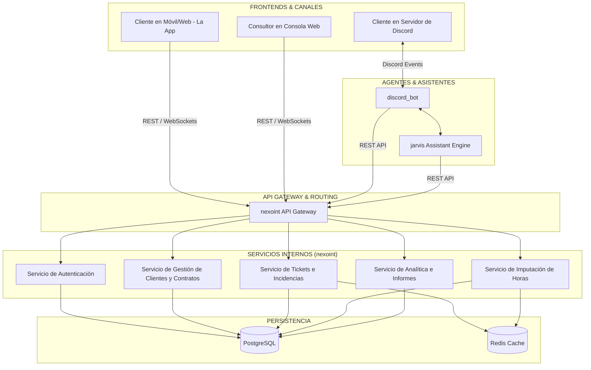
```mermaid
flowchart TD
    subgraph sub_FRONTENDS_CANALES ["FRONTENDS & CANALES"]
        A1["Cliente en Móvil/Web - La App"]
        A2["Cliente en Servidor de Discord"]
        A3["Consultor en Consola Web"]
    end

    subgraph sub_API_GATEWAY_ROUTING ["API GATEWAY & ROUTING"]
        GW["nexoint API Gateway"]
    end

    subgraph sub_SERVICIOS_INTERNOS_nexoint ["SERVICIOS INTERNOS (nexoint)"]
        S1["Servicio de Autenticación"]
        S2["Servicio de Gestión de Clientes y Contratos"]
        S3["Servicio de Tickets e Incidencias"]
        S4["Servicio de Imputación de Horas"]
        S5["Servicio de Analítica e Informes"]
    end

    subgraph sub_AGENTES_ASISTENTES ["AGENTES & ASISTENTES"]
        B1["discord_bot"]
        B2["jarvis Assistant Engine"]
    end

    subgraph sub_PERSISTENCIA ["PERSISTENCIA"]
        DB[("PostgreSQL")]
        Cache[("Redis Cache")]
    end

    A1 -->|REST / WebSockets| GW
    A2 <-->|Discord Events| B1
    A3 -->|REST / WebSockets| GW

    B1 <--> B2
    B1 -->|REST API| GW
    B2 -->|REST API| GW

    GW --> S1
    GW --> S2
    GW --> S3
    GW --> S4
    GW --> S5

    S1 --> DB
    S2 --> DB
    S3 --> DB
    S4 --> DB
    S5 --> DB

    S3 --> Cache
    S4 --> Cache
```

---

### 3.6 Diagrama de Componentes y Despliegue de Infraestructura

La arquitectura física y de contenedores desacopla la capa de presentación de la capa de orquestación de agentes y persistencia BaaS:

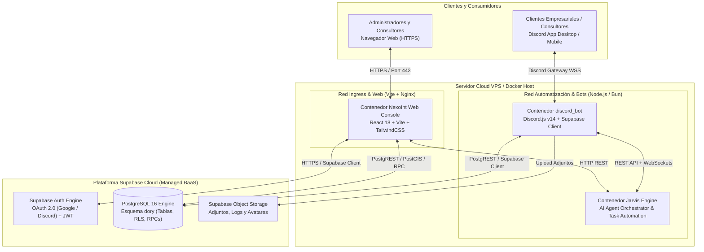
```mermaid
graph TB
    subgraph sub_Servidor_Cloud_VPS ["Servidor Cloud VPS / Docker Host"]
        subgraph sub_Red_Ingress_Web ["Red Ingress & Web (Vite + Nginx)"]
            SPA["Contenedor NexoInt Web Console<br>React 18 + Vite + TailwindCSS"]
        end

        subgraph sub_Red_Automatizacion_IA ["Red Automatización & Bots (Node.js / Bun)"]
            BOT_CORE["Contenedor discord_bot<br>Discord.js v14 + Supabase Client"]
            JARVIS_API["Contenedor Jarvis Engine<br>AI Agent Orchestrator & Task Automation"]
        end
    end

    subgraph sub_Plataforma_Supabase_Cloud ["Plataforma Supabase Cloud (Managed BaaS)"]
        AUTH_ENGINE["Supabase Auth Engine<br>OAuth 2.0 (Google / Discord) + JWT"]
        PG_DORY[("PostgreSQL 16 Engine<br>Esquema dory (Tablas, RLS, RPCs)")]
        STORAGE["Supabase Object Storage<br>Adjuntos, Logs y Avatares"]
    end

    subgraph sub_Clientes_y_Consumidores ["Clientes y Consumidores"]
        CLIENT_USER["Clientes Empresariales / Consultores<br>Discord App Desktop / Mobile"]
        ADMIN_USER["Administradores y Consultores<br>Navegador Web (HTTPS)"]
    end

    CLIENT_USER <-->|Discord Gateway WSS| BOT_CORE
    ADMIN_USER <-->|HTTPS / Port 443| SPA

    SPA <-->|HTTPS / Supabase Client| AUTH_ENGINE
    SPA <-->|PostgREST / PostGIS / RPC| PG_DORY
    SPA <-->|HTTP REST| JARVIS_API

    BOT_CORE <-->|PostgREST / Supabase Client| PG_DORY
    BOT_CORE <-->|REST API + WebSockets| JARVIS_API
    BOT_CORE -->|Upload Adjuntos| STORAGE
```

---

### 3.7 Modelo de Datos Relacional y Esquema de Entidades (Esquema `dory`)

El siguiente diagrama entidad-relación refleja con precisión las tablas transaccionales del esquema `dory` en Supabase, la correspondencia con Discord y el control de horas de soporte:

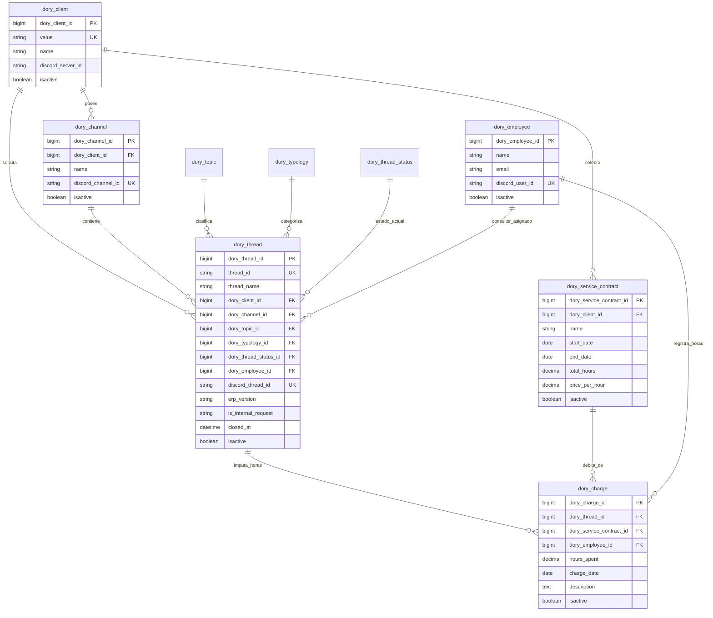
```mermaid
erDiagram
    dory_client ||--o{ dory_channel : posee
    dory_client ||--o{ dory_thread : solicita
    dory_channel ||--o{ dory_thread : contiene
    dory_client ||--o{ dory_service_contract : celebra
    dory_topic ||--o{ dory_thread : clasifica
    dory_typology ||--o{ dory_thread : categoriza
    dory_thread_status ||--o{ dory_thread : estado_actual
    dory_employee ||--o{ dory_thread : consultor_asignado
    dory_thread ||--o{ dory_charge : imputa_horas
    dory_service_contract ||--o{ dory_charge : debita_de
    dory_employee ||--o{ dory_charge : registra_horas

    dory_client {
        bigint dory_client_id PK
        string value UK
        string name
        string discord_server_id
        boolean isactive
    }

    dory_channel {
        bigint dory_channel_id PK
        bigint dory_client_id FK
        string name
        string discord_channel_id UK
        boolean isactive
    }

    dory_employee {
        bigint dory_employee_id PK
        string name
        string email
        string discord_user_id UK
        boolean isactive
    }

    dory_thread {
        bigint dory_thread_id PK
        string thread_id UK
        string thread_name
        bigint dory_client_id FK
        bigint dory_channel_id FK
        bigint dory_topic_id FK
        bigint dory_typology_id FK
        bigint dory_thread_status_id FK
        bigint dory_employee_id FK
        string discord_thread_id UK
        string erp_version
        string is_internal_request
        datetime closed_at
        boolean isactive
    }

    dory_service_contract {
        bigint dory_service_contract_id PK
        bigint dory_client_id FK
        string name
        date start_date
        date end_date
        decimal total_hours
        decimal price_per_hour
        boolean isactive
    }

    dory_charge {
        bigint dory_charge_id PK
        bigint dory_thread_id FK
        bigint dory_service_contract_id FK
        bigint dory_employee_id FK
        decimal hours_spent
        date charge_date
        text description
        boolean isactive
    }
```

---

## 4. Fase III: Estrategias de Implantación, Pruebas y Auditoría Informática

### 4.1 Plan de Pruebas Automatizadas y de Integración

| Nivel de Prueba | Alcance y Herramientas | Criterio de Éxito |
| :--- | :--- | :--- |
| **Pruebas Unitarias** | Validación de funciones de negocio de `nexoint`, cálculo de horas y endpoints individuales con `pytest` / `jest`. | Cobertura de código superior al 85%. |
| **Pruebas de Integración** | Simulación del ciclo completo: Mensaje en Discord -> `discord_bot` -> `nexoint` -> PostgreSQL -> Actualización en `la app`. | 100% de coherencia en estados y persistencia sin pérdidas de datos. |
| **Pruebas de Carga y Rendimiento** | Pruebas de estrés a la API de `nexoint` simulando 500 solicitudes concurrentes con `Locust` o `K6`. | Tiempo de respuesta p95 < 250 ms con 0% de errores HTTP 5xx. |
| **Pruebas de Aceptación (UAT)** | Validación directa con el personal de ERP Consultores y Asociados C.A. y clientes de prueba. | Firma de conformidad y usabilidad satisfactoria. |

### 4.2 Plan de Auditoría Informática y Seguridad
De acuerdo con el esquema PST IV 2018, se debe incluir un **Informe de Resultados de Auditoría Informática**:
1. **Análisis de Vulnerabilidades:** Evaluación con herramientas estáticas (SAST: SonarQube, Bandit) y dinámicas (DAST: OWASP ZAP).
2. **Auditoría de Control de Accesos:** Verificación de integridad de tokens JWT, expiración forzada y validación estricta de roles RBAC.
3. **Auditoría de Base de Datos:** Verificación de políticas de respaldo automatizado diario (`pg_dump` con cifrado) y planes de recuperación ante desastres (RPO < 2 horas, RTO < 30 minutos).

---

## 5. Fase IV: Resultados, Diagrama de Red y Evaluación Integral de Riesgos

### 5.1 Diagrama Físico y Lógico de la Red

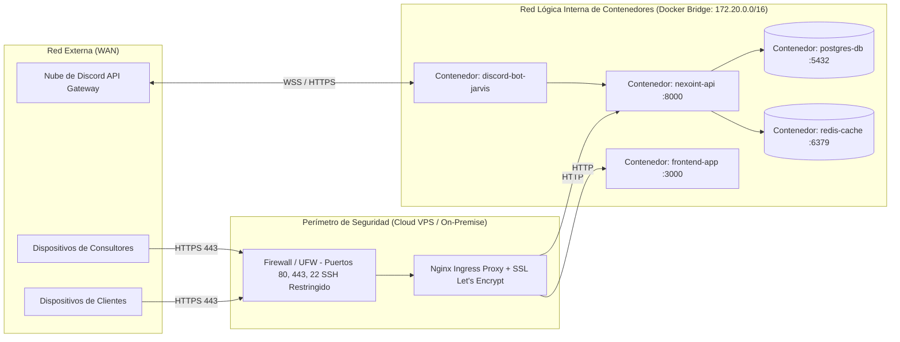
```mermaid
flowchart LR
    subgraph sub_Red_Externa_WAN ["Red Externa (WAN)"]
        USR_CLI["Dispositivos de Clientes"]
        USR_CON["Dispositivos de Consultores"]
        DISC_CLOUD["Nube de Discord API Gateway"]
    end

    subgraph sub_Per_metro_de_Seguridad_Cloud_VPS_On_Premise ["Perímetro de Seguridad (Cloud VPS / On-Premise)"]
        FW["Firewall / UFW - Puertos 80, 443, 22 SSH Restringido"]
        REV_PROXY["Nginx Ingress Proxy + SSL Let's Encrypt"]
    end

    subgraph sub_Red_L_gica_Interna_de_Contenedores_Docker_Bridge_172_20_0_0_16 ["Red Lógica Interna de Contenedores (Docker Bridge: 172.20.0.0/16)"]
        API_CTR["Contenedor: nexoint-api :8000"]
        BOT_CTR["Contenedor: discord-bot-jarvis"]
        APP_CTR["Contenedor: frontend-app :3000"]
        DB_CTR[("Contenedor: postgres-db :5432")]
        RED_CTR[("Contenedor: redis-cache :6379")]
    end

    USR_CLI -->|HTTPS 443| FW
    USR_CON -->|HTTPS 443| FW
    DISC_CLOUD <-->|WSS / HTTPS| BOT_CTR

    FW --> REV_PROXY
    REV_PROXY -->|HTTP| API_CTR
    REV_PROXY -->|HTTP| APP_CTR
    BOT_CTR --> API_CTR
    API_CTR --> DB_CTR
    API_CTR --> RED_CTR
```

### 5.2 Matriz de Factores y Evaluación de Riesgos

| Factor de Riesgo | Tipo | Nivel | Estrategia de Mitigación / Plan de Contingencia |
| :--- | :--- | :---: | :--- |
| **Caídas en API de Discord** | Tecnológico / Externo | Medio | `la app` opera de forma autónoma con su propio chat y sistema de tickets directo con `nexoint`. |
| **Pérdida de Fluido Eléctrico / Red Local** | Operativo / Físico | Alto | Despliegue de los servicios en Servidor Privado Virtual (VPS en la nube) con alta disponibilidad y UPS en sucursales locales. |
| **Filtración de Datos de Contratos** | Seguridad / Legal | Crítico | Cifrado de datos en reposo y en tránsito (TLS 1.3), tokens firmados con claves asimétricas y auditoría de eventos. |
| **Resistencia al Cambio de Usuarios** | Social / Humano | Bajo | Jornadas de capacitación programadas y diseño centrado en la experiencia de usuario (UI/UX) simplificada. |
| **Variación de Costos de Infraestructura** | Financiero | Bajo | Utilización de software 100% de código abierto (PostgreSQL, Docker, Linux, Python/JS) sin licenciamiento privativo. |

---

## 6. Fase V: Estructura de Manuales y Políticas de Seguridad

De acuerdo con el esquema oficial de PST IV, el informe final debe incorporar:
1. **Manual de Usuario:** Guía ilustrada para clientes (uso de `la app` y comandos de Discord) y consultores (atención, registro de horas).
2. **Manual de Sistemas:** Documentación técnica de arquitectura, endpoints Swagger/OpenAPI, diagramas E/R y contratos de microservicios.
3. **Manual de Instalación:** Instrucciones paso a paso para desplegar el ecosistema mediante Docker Compose (`docker compose up -d`) y variables de entorno `.env`.
4. **Manual de Normas y Procedimientos:** Procedimientos operativos estandarizados para alta de clientes, cierre de mes contable y resolución de incidencias.
5. **Políticas y Estándares de Seguridad Informática:**
   - *Seguridad Física:* Control de acceso a servidores locales y terminales de trabajo.
   - *Seguridad Lógica:* Política de contraseñas robustas, rotación periódica de tokens y llaves API, y política de copias de seguridad redundantes.

---

## 7. Guía Metodológica y Asignación de Tareas para la Redacción del Informe

> [!IMPORTANT]
> **Propósito de esta Documentación:**  
> Este documento técnico, junto con el [Modelo de Base de Datos](../database/README.md) y los diagramas generados, constituye la **base de ingeniería y arquitectura** del proyecto. El objetivo es que los demás integrantes del equipo de proyecto tomen estos insumos como punto de partida y se encarguen de la **redacción académica, justificación teórica y desarrollo de los capítulos del informe final** exigido por la coordinación del PNFI.

### 7.1 Matriz de Tareas y Qué Debe Redactar el Equipo por Fase

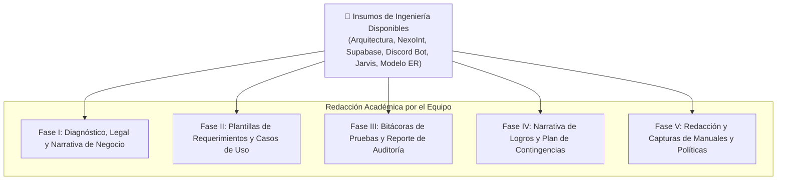
```mermaid
flowchart TD
    Base["📐 Insumos de Ingeniería Disponibles<br>(Arquitectura, NexoInt, Supabase, Discord Bot, Jarvis, Modelo ER)"]
    
    subgraph sub_Redacci_n_Acad_mica_por_el_Equipo ["Redacción Académica por el Equipo"]
        F1["Fase I: Diagnóstico, Legal y Narrativa de Negocio"]
        F2["Fase II: Plantillas de Requerimientos y Casos de Uso"]
        F3["Fase III: Bitácoras de Pruebas y Reporte de Auditoría"]
        F4["Fase IV: Narrativa de Logros y Plan de Contingencias"]
        F5["Fase V: Redacción y Capturas de Manuales y Políticas"]
    end

    Base --> F1
    Base --> F2
    Base --> F3
    Base --> F4
    Base --> F5
```

---

### 7.2 Detalle de Responsabilidades de Redacción

#### 📝 Fase I: Planificación del Proyecto y Diagnóstico Situacional
- **Qué tienen listo como base:** El modelo de negocio CANVAS, los actores clave, el árbol del problema y la matriz FODA estructurada en este documento.
- **Qué debe redactar el equipo:**
  1. *Antecedentes y Reseña Histórica:* Expandir la historia y organigrama de ERP Consultores y Asociados C.A.
  2. *Fundamentación Legal:* Redactar la justificación articulada con la **Constitución de la República Bolivariana de Venezuela (Art. 110)**, la **Ley de Infogobierno**, el **Plan de la Patria (Objetivos Históricos y Nacionales)** y el **Decreto 3.390 sobre Software Libre**.
  3. *Factibilidad:* Redactar el análisis descriptivo de factibilidad social, económica, operativa y técnica.
  4. *Narrativa del Problema:* Convertir el árbol de problemas y la matriz FODA en párrafos narrativos fluidos y contextualizados.

---

#### 📝 Fase II: Requerimientos, Diseño y Desarrollo del Software
- **Qué tienen listo como base:** La arquitectura modular (`nexoint`, `discord_bot`/`jarvis`, `la app`), los esquemas de bases de datos `dory`, el flujo de eventos, la seguridad OWASP/NIST y los logins externos.
- **Qué debe redactar el equipo:**
  1. *Plantillas de Requerimientos Funcionales y No Funcionales:* Llenar cada ficha oficial del PNFI (ID, Nombre, Descripción detallada, Prioridad, Actor) para los módulos de Tickets, Contratos, Imputación de Horas, Seguridad y Releases.
  2. *Plantillas de Casos de Uso del Software (CUS):* Elaborar las planillas de especificación de casos de uso maestros (Gestión de Clientes, Contratos, Usuarios) y transaccionales (Apertura de Ticket por Discord, Imputación de Horas, Ejecución de Release con Jarvis).
  3. *Justificación Metodológica:* Redactar la justificación del uso de la metodología **MeRinde** combinada con prácticas ágiles y el estándar de calidad **RECLAMO**.
  4. *Interfaces de Usuario:* Adjuntar capturas de pantalla de los formularios de `nexoint` y maquetas de `la app` con sus descripciones funcionales.

---

#### 📝 Fase III: Implantación, Pruebas y Auditoría Informática
- **Qué tienen listo como base:** El plan de pruebas unitarias, de integración, rendimiento y el alcance de auditoría informática.
- **Qué debe redactar el equipo:**
  1. *Casos de Prueba Detallados:* Llenar las tablas de casos de prueba con: Entrada de datos, Pasos de ejecución, Resultado esperado y Resultado obtenido (con capturas de pantalla de logs o respuestas de la API).
  2. *Informe de Auditoría Informática:* Redactar el informe formal de auditoría explicando las herramientas utilizadas (SAST, DAST, análisis de endpoints, revisión de base de datos) y emitiendo el dictamen y recomendaciones.
  3. *Análisis de Métricas:* Redactar la interpretación cualitativa y cuantitativa de las métricas de software obtenidas.

---

#### 📝 Fase IV: Resultados y Logros del Proyecto
- **Qué tienen listo como base:** El diagrama lógico/físico de red, la topología de contenedores Docker/Supabase y la matriz de factores de riesgo.
- **Qué debe redactar el equipo:**
  1. *Descripción del Producto:* Redactar la memoria descriptiva final explicando cómo el ecosistema resuelve la problemática diagnosticada en la Fase I y mejora el desempeño de la empresa.
  2. *Plan de Contingencia de Riesgos:* Desarrollar los párrafos explicativos de cada factor de riesgo (financiero, técnico, ambiental, legal) y su protocolo de mitigación.

---

#### 📝 Fase V: Manuales y Normativas
- **Qué tienen listo como base:** El índice y estructura de contenidos requeridos por el esquema 2018.
- **Qué debe redactar el equipo:**
  1. *Manual de Usuario:* Redactar la guía ilustrada paso a paso con capturas para el cliente (cómo abrir tickets por Discord / Web) y para el consultor (cómo registrar horas y cerrar tickets).
  2. *Manual de Sistemas:* Compilar los contratos de endpoints OpenAPI/Swagger, variables de entorno y diagramas de bases de datos.
  3. *Manual de Instalación:* Guía de despliegue paso a paso para desarrolladores (`pnpm install`, `.env`, conexión a Supabase y Docker Compose).
  4. *Manual de Normas y Procedimientos:* Protocolos operativos internos de soporte y atención.
  5. *Políticas de Seguridad Informática:* Documento formal con las políticas de contraseñas, control de accesos RBAC y respaldo de información.

---

### 7.3 Checklist de Verificación para la Entrega Final

Antes de la entrega del informe final a la coordinación del PNFI y tutores, el equipo debe verificar:

- [ ] ¿Todas las fases I a V siguen la estructura exacta del [Esquema PST 2018](../esquemas-pst-2018.md#4-proyecto-socio-tecnológico-iv-trayecto-iv)?
- [ ] ¿Se utilizaron las plantillas oficiales para los Requerimientos Funcionales y No Funcionales?
- [ ] ¿Las especificaciones de casos de uso tienen sus diagramas de secuencia/actividad asociados?
- [ ] ¿El modelo de base de datos coincide con el [Diccionario de Datos del Esquema `dory`](../database/README.md)?
- [ ] ¿Se incluyeron todas las reflexiones críticas al final de cada fase?
- [ ] ¿Los manuales de usuario, sistemas, instalación y seguridad cuentan con imágenes y texto explicativo claro?
